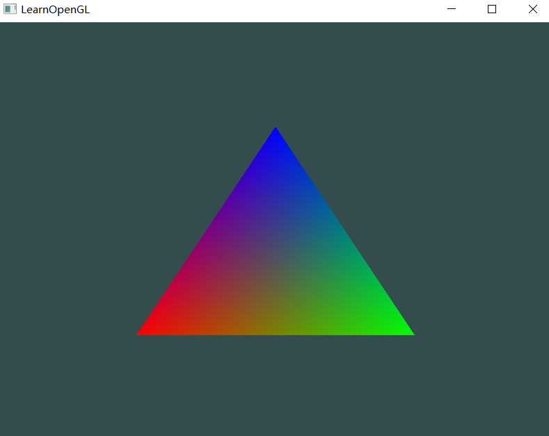
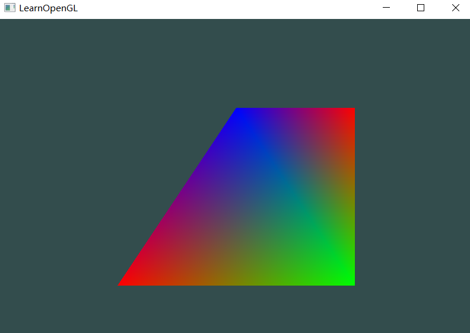

首先绑定 VBO ，把实际的数据写入 VBO ，然后绑定 VAO 和读取规则，从已经绑定的 VBO 里面读取，绘制时绑定需要绘制的 VAO 就可以了



```cpp
#include <glad/glad.h>
#include <GLFW/glfw3.h>
#include <iostream>

void framebuffer_size_callback(GLFWwindow* window, int width, int height);
void processInput(GLFWwindow* window);
const unsigned int SCR_WIDTH = 800;
const unsigned int SCR_HEIGHT = 600;

const char* vertexShaderSource = "#version 330 core\n"
"layout (location=0) in vec3 aPos;\n"
"layout (location=1) in vec3 aColor;\n"
"out vec3 vertexColor;\n"
"void main()\n"
"{\n"
"   gl_Position = vec4(aPos.x, aPos.y, aPos.z, 1.0);\n"
"   vertexColor = aColor;\n"
"}\0";

const char* fragmentShaderSource = "#version 330 core\n"
"in vec3 vertexColor;\n"
"out vec4 FragColor;\n"
"void main()\n"
"{\n"
"   FragColor = vec4(vertexColor, 1.0f);\n"
"}\n\0";

int main()
{
    glfwInit();
    glfwWindowHint(GLFW_CONTEXT_VERSION_MAJOR, 3);
    glfwWindowHint(GLFW_CONTEXT_VERSION_MINOR, 3);
    glfwWindowHint(GLFW_OPENGL_PROFILE, GLFW_OPENGL_CORE_PROFILE);

    GLFWwindow* window = glfwCreateWindow(SCR_WIDTH, SCR_HEIGHT, "LearnOpenGL", NULL, NULL);
    if (window == NULL)
    {
        std::cout << "Failed to create GLFW window" << std::endl;
        glfwTerminate();
        return -1;
    }
    glfwMakeContextCurrent(window);
    glfwSetFramebufferSizeCallback(window, framebuffer_size_callback);

    if (!gladLoadGLLoader((GLADloadproc)glfwGetProcAddress)) {
        std::cout << "Failed to initialize GLAD" << std::endl;
        return -1;
    }

    unsigned int vertexShader = glCreateShader(GL_VERTEX_SHADER);
    glShaderSource(vertexShader, 1, &vertexShaderSource, NULL);
    glCompileShader(vertexShader);

    unsigned int fragmentShader = glCreateShader(GL_FRAGMENT_SHADER);
    glShaderSource(fragmentShader, 1, &fragmentShaderSource, NULL);
    glCompileShader(fragmentShader);

    unsigned int shaderProgram = glCreateProgram();
    glAttachShader(shaderProgram, vertexShader);
    glAttachShader(shaderProgram, fragmentShader);
    glLinkProgram(shaderProgram);

    glDeleteShader(vertexShader);
    glDeleteShader(fragmentShader);

    float vertices[] = {
        -0.5f, -0.5f, 0.0f,  1.0f, 0.0f, 0.0f,
         0.5f, -0.5f, 0.0f,  0.0f, 1.0f, 0.0f,
         0.0f,  0.5f, 0.0f,  0.0f, 0.0f, 1.0f
    };

    unsigned int VBO, VAO;
    glGenBuffers(1, &VBO);
    glGenVertexArrays(1, &VAO);
    // 绑定 VAO 和 VBO
    glBindVertexArray(VAO);
    glBindBuffer(GL_ARRAY_BUFFER, VBO);
    // 读值进已经绑定的 VBO 
    glBufferData(GL_ARRAY_BUFFER, sizeof(vertices), vertices, GL_STATIC_DRAW);
    // 第一个 0 是 location，(void*)0 是因为位置信息从 vertices 数组的 0 开始读 
    glVertexAttribPointer(0, 3, GL_FLOAT, GL_FALSE, 6 * sizeof(float), (void*)0);
    // 0 是 location 
    glEnableVertexAttribArray(0);
    // 第一个 1 是 location，(void*)(3 * sizeof(float)) 是因为 vertices 数组前三个是位置信息
    glVertexAttribPointer(1, 3, GL_FLOAT, GL_FALSE, 6 * sizeof(float), (void*)(3 * sizeof(float)));
    // 1 是 location 
    glEnableVertexAttribArray(1);
    // 取消 VAO 和 VBO 的绑定
    glBindBuffer(GL_ARRAY_BUFFER, 0);
    glBindVertexArray(0);

    while (!glfwWindowShouldClose(window)) {
        processInput(window);

        glClearColor(0.2f, 0.3f, 0.3f, 1.0f);
        glClear(GL_COLOR_BUFFER_BIT);

        glUseProgram(shaderProgram);
        glBindVertexArray(VAO);
        glDrawArrays(GL_TRIANGLES, 0, 3);

        glfwSwapBuffers(window);
        glfwPollEvents();
    }

    glDeleteVertexArrays(1, &VAO);
    glDeleteBuffers(1, &VBO);
    glDeleteProgram(shaderProgram);

    glfwTerminate();
    return 0;
}

void framebuffer_size_callback(GLFWwindow* window, int width, int height) {
    glViewport(0, 0, width, height);
}

void processInput(GLFWwindow* window)
{
    if (glfwGetKey(window, GLFW_KEY_ESCAPE) == GLFW_PRESS)
        glfwSetWindowShouldClose(window, true);
}
```


## IBO/EBO

为了重复利用顶点，需要有索引记录哪些点用来构成同一个图形（注意 IBO 和 VBO 数据的写入都需要在 VAO 被绑定之后）同时，glDrawArrays 需要换成 glDrawElements 。

使用四个顶点绘制两个三角形：

```cpp
    float vertices[] = {
        -0.5f, -0.5f, 0.0f,  1.0f, 0.0f, 0.0f,
         0.5f, -0.5f, 0.0f,  0.0f, 1.0f, 0.0f,
         0.0f,  0.5f, 0.0f,  0.0f, 0.0f, 1.0f,
         0.5f,  0.5f, 0.0f,  1.0f, 0.0f, 0.0f,
    };

    unsigned int indices[] = {
        0,1,2,
        1,2,3
    };
    glBindBuffer(GL_ELEMENT_ARRAY_BUFFER, IBO);
    glBufferData(GL_ELEMENT_ARRAY_BUFFER, sizeof(indices), indices,GL_STATIC_DRAW);
```

glDrawArrays(GL_TRIANGLES, 0, 3);  ->  glDrawElements(GL_TRIANGLES, 6, GL_UNSIGNED_INT, 0);

