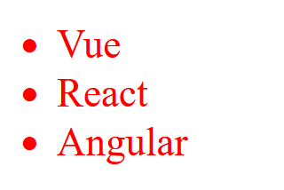

# JSX

### JSX用大括号识别对象

- 引号中放字符串
- js变量
- js对象
- 方法调用

下面渲染一个列表，`li`中的`key`是`React`框架需要用的，暂时无需关注

```js
//App.js
const list = [
    {id: 1001, name:'Vue'},
    {id: 1002, name: 'React'},
    {id: 1003, name: 'Angular'}
]
function App() {
    return (
        <div style={{color:"red",fontSize:"30px"}}> //第一个大括号表示需要解引用，第二个大括号表示这是一个js对象
            <ul>
                {list.map(item => <li key={item.id}>{item.name}</li>)}
            </ul>
        </div>

    )
}

export default App;
```



### Props

向JSX标签传递的信息的为props

```js
//App.js
function Greeting({ name }) {
    return <h1>Hello, {name}</h1>;
}

export default function App() {
    return <Greeting name="world" /> //Hello,world
}
```

### 条件渲染

`&&`表示如果条件为真就显示对应的对象，`? :`表示选择运算符

```js
          {isLogin && <span>Jack</span>}
          {isLogin ? <span>Jack</span> : <span>Login...</span>}
```

