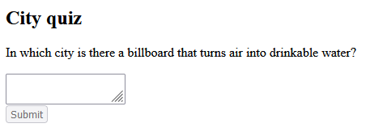

# 交互

### 自定义交互函数并调用

```js
//App.js
export default function Interactive(){
    function clicked(){
        alert("Pressed");
    }
    return (
        <button onClick={clicked}>  //点击按钮就显示Pressed
            Press
        </button>  
    );
}
```

### 箭头函数重写

```js
//App.js
export default function Interactive(){
    return (
        <button onClick={() => {
            alert("Pressed");
        }}>
            Press
        </button>
    );
}
```

### 事件处理中使用props

```js
//App.js 
function AlertButton({ message, children }) {  //childern是React中的特殊prop 自动获取标签闭合起来的内容当作它的值
    return (
        <button onClick={() => alert(message)}>
            {children}
        </button>
    );
}

export default function Toolbar() {
    return (
        <div>
            <AlertButton message="正在播放！">
                播放电影
            </AlertButton>
            <AlertButton message="正在上传！">
                上传图片
            </AlertButton>
        </div>
    );
}
```

### 事件传播

```js
//App.js 点击“播放电影”按钮会显示“正在播放！”  点击“上传图片”按钮先显示“正在上传！”然后显示“你点击了 toolbar ！”
export default function Toolbar() {
    return (
        <div className="Toolbar" onClick={() => {
            alert('你点击了 toolbar ！');
        }}>
            <button onClick={(e) => {
                e.stopPropagation();
                alert('正在播放！')
            }}>
                播放电影
            </button>
            <button onClick={() => alert('正在上传！')}>
                上传图片
            </button>
        </div>
    );
}
```

### 阻止默认行为

```js
//App.js
export default function Signup() {
    return (
        <form onSubmit={e => {
            e.preventDefault(); //阻止了默认行为，提交表单时不会刷新页面
            alert('提交表单！');
        }}>
            <input />
            <button>提交</button>
        </form>
    );
}
```

### state

利用state可以记录状态

```js
//App.js
import { useState } from 'react';
import { myList } from './data.js';

export default function Gallery() {
    const [index, setIndex] = useState(0);
    const [show,setShow] = useState(false);
    function handleClickIndex() {
        setIndex( (index + 1) % myList.length );
    }
    function handleClickShow(){
        setShow(!show);
    }
    let myListElement = myList[index];
    return (
        <>
            <button onClick={handleClickIndex}>
                Next
            </button>
            <h3>
                <i>{myListElement.name} </i>
            </h3>
            <h4>
                ({index + 1} of {myList.length})
            </h4>
            <button onClick={handleClickShow}>
                {show ? 'Hide' : 'Show'}
            </button>
            {show && <p>{myListElement.details}</p>}
            <br/>
            
        </>
    );
}
```

```js
//data.js
export const myList = [
    {
      name:"first",
      url:"./OIP.jpg",
      details:"Yor"
    },
    {
        name:"second",
        url:"./Yor.jpg",
        details:"Yor"
    }
]
```


#### state与快照

state如同一张快照，改变state的函数只是告诉浏览器，在下一次渲染的时候需要更改state，而不是实时更改

```js
//App.js  这里的+3按钮按下去后只会让number+1 而不是 +3
import { useState } from 'react';
export default function Counter() {
  const [number, setNumber] = useState(0);

  return (
      <>
        <h1>{number}</h1>
        <button onClick={() => {
          setNumber(number + 1);
          setNumber(number + 1);
          setNumber(number + 1);
        }}>+3</button>
      </>
  )
}
```

state会有历史记录，不会受到时延函数的影响

```js
//App.js  
import { useState } from 'react';

export default function Form() {
    const [to, setTo] = useState('Alice');
    const [message, setMessage] = useState('你好');

    function handleSubmit(e) {
        e.preventDefault();
        setTimeout(() => {
            alert(`你向 ${to} 说了${message}`);
        }, 5000);
    }

    return (
        <form onSubmit={handleSubmit}>
            <label>
                To:{' '}
                <select
                    value={to}
                    onChange={e => setTo(e.target.value)}>
                    <option value="Alice">Alice</option>
                    <option value="Bob">Bob</option>
                </select>
            </label>
            <br/>
            <textarea
                placeholder="Message"
                value={message}
                onChange={e => setMessage(e.target.value)}
            />
            <button>发送</button>
        </form>
    );
}
```

这里发送的是什么就会受到什么警示信息，不会因为五秒（时延）之内修改选项或者文本框的内容而受到不同的警示


#### 更新函数

```js
//下面的按钮可以+3
import { useState } from 'react';
export default function Counter() {
    const [number, setNumber] = useState(0);

    return (
        <>
            <h1>{number}</h1>
            <button onClick={() => {
                setNumber(n => n + 1);
                setNumber(n => n + 1);
                setNumber(n => n + 1);
            }}>+3</button>
        </>
    )
}
```

#### state应当用专用接口来改

```js
import { useState } from 'react';
export default function MovingDot() {
    const [position, setPosition] = useState({  
        x: 0,
        y: 0
    });
    return (
        <div
            onPointerMove={e => {
                setPosition({   //必须用setPosition来改
                    x: e.clientX,
                    y: e.clientY
                });
            }}
            style={{
                position: 'relative',
                width: '100vw',
                height: '100vh',
            }}>
            //一个随着鼠标一移动的红圆
            <div style={{
                position: 'absolute',
                backgroundColor: 'red',
                borderRadius: '50%',
                transform: `translate(${position.x}px, ${position.y}px)`,
                left: -10,  //为了移动过程，圆心对齐鼠标
                top: -10,
                width: 20, //-20相当于'-20px'
                height: 20,
            }} />
        </div>
    );
}
```

因为需要专用接口来改，而专用接口每次都要把所有属性都改一边，所以用展开语法来拷贝会更有效率

```js
//下面的程序实时显示输入框的内容
import { useState } from 'react';

export default function Form() {
    const [person, setPerson] = useState({
        firstName: 'Barbara',
        lastName: 'Hepworth',
        email: 'bhepworth@sculpture.com'
    });

    function handleFirstNameChange(e) {
        setPerson({
            ...person,
            firstName: e.target.value
        });
    }

    function handleLastNameChange(e) {
        setPerson({
            ...person,
            lastName: e.target.value
        });
    }

    function handleEmailChange(e) {
        setPerson({
            ...person,
            email: e.target.value
        });
    }

    return (
        <>
            <label>
                First name:
                <input
                    value={person.firstName}
                    onChange={handleFirstNameChange}
                />
            </label>
            <label>
                Last name:
                <input
                    value={person.lastName}
                    onChange={handleLastNameChange}
                />
            </label>
            <label>
                Email:
                <input
                    value={person.email}
                    onChange={handleEmailChange}
                />
            </label>
            <p>
                {person.firstName}{' '}
                {person.lastName}{' '}
                ({person.email})
            </p>
        </>
    );
}
```


但是展开语法只是做浅拷贝，如果设计到嵌套对象，那么要用Immer
先安装`npm install use-immer`
用`import { useImmer } from 'use-immer';`替代`import { useState } from 'react';`

```js
import { useImmer } from 'use-immer';

export default function Form() {
    const [person, updatePerson] = useImmer({
        name: 'Niki de Saint Phalle',
        artwork: {
            title: 'Blue Nana',
            city: 'Hamburg',
        }
    });

    function handleNameChange(e) {
        updatePerson(draft => {
            draft.name = e.target.value;
        });
    }

    function handleTitleChange(e) {
        updatePerson(draft => {
            draft.artwork.title = e.target.value;
        });
    }

    function handleCityChange(e) {
        updatePerson(draft => {
            draft.artwork.city = e.target.value;
        });
    }


    return (
        <>
            <label>
                Name:
                <input
                    value={person.name}
                    onChange={handleNameChange}
                />
            </label>
            <label>
                Title:
                <input
                    value={person.artwork.title}
                    onChange={handleTitleChange}
                />
            </label>
            <label>
                City:
                <input
                    value={person.artwork.city}
                    onChange={handleCityChange}
                />
            </label>
            <p>
                <i>{person.artwork.title}</i>
                {' by '}
                {person.name}
                <br />
                (located in {person.artwork.city})
            </p>
        </>
    );
}
```


#### 以状态变量响应输入

```js
import { useState } from 'react';

function submitForm(answer) {
    return new Promise((resolve, reject) => {
            let shouldError = answer.toLowerCase() !== 'lima'
            if (shouldError) {
                reject(new Error('Good guess but a wrong answer. Try again!'));
            } else {
                resolve();
            }
    });
}

export default function Form() {
    const [answer, setAnswer] = useState('');
    const [error, setError] = useState(null);
    const [status, setStatus] = useState('typing');
    const [show,setShow] = useState(false);
    if (status === 'success') {
        return <h1>That's right!</h1>
    }

    async function handleSubmit(e) { //考虑到实际网页提交表单可能需要比较久的时间，这里做成异步函数
        e.preventDefault();
        setStatus('submitting');
        try {
            await submitForm(answer);  //必须校验结果再进行下一步
            setStatus('success');
        } catch (err) {
            setStatus('typing');
            setError(err);
            setShow(true);  //答案错误就显示警示信息
        }
    }

    function handleTextareaChange(e) {
        setShow(false);  //正在修改值就让错误警示信息消失
        setAnswer(e.target.value); 
    }

    return (
        <>
            <h2>City quiz</h2>
            <p>
                In which city is there a billboard that turns air into drinkable water?
            </p>
            <form onSubmit={handleSubmit}>
                <textarea
                    value={answer}
                    onChange={handleTextareaChange}
                    disabled={status === 'submitting'}
                />
                <br />
                <button disabled={
                    answer.length === 0 ||
                    status === 'submitting'
                }>
                    Submit
                </button>
                {show &&
                    <p className="Error">
                        {error.message}
                    </p>
                }
            </form>
        </>
    );
}

```

内容为空时禁用提交按钮，提交时禁用整个表单，提交错误就显示错误警示，提交正确就显示正确提示，正在改值就隐藏错误警示



#### 在组件间共享状态

下面的程序用一个选择号设定被选中的对象，从而实现状态共享

```js
import { useState } from 'react';

export default function Accordion() {
    const [activeIndex, setActiveIndex] = useState(0);  //用一个变量表示选择显示的对象
    return (
        <>
            <h3>间谍过家家</h3>
            <Panel
                title="黄昏"
                isActive={activeIndex === 0}
                onShow={() => setActiveIndex(0)}
            >
                黄昏是西人民共和国情报局对东科WISE下属的一名间谍，也是最有实力的谍报人员。
            </Panel>
            <Panel
                title="约尔"
                isActive={activeIndex === 1}
                onShow={() => setActiveIndex(1)}
            >
                约尔是一名代号为“荆棘公主”的杀手。
            </Panel>
        </>
    );
}

function Panel({
                   title,
                   children,
                   isActive,
                   onShow
               }) {
    return ( //必须放在一个父标签之内
        <div>
            <h4>{title}</h4>
            {isActive ? (
                <p>{children}</p>
            ) : (
                <button onClick={onShow}>
                    显示
                </button>
            )}
        </div>
    );
}
```

两份资料只会显示一份


#### 组件的重置与保留

默认情况下，同一个位置是相同的组件（允许prop不同），那么就会保留
但如果是不同的组件，那么就会重置
**同一个位置指的是同一个表达式（if else或者？：表达式）**

下面这种情况不是同一个位置

 `{isPlayerA && <Counter person="Taylor" />} `

 `{!isPlayerA && <Counter person="Sarah" />}`

```js
import { useState } from 'react';
import './resetState.css'
export default function App() {
    const [isFancy, setIsFancy] = useState(false);
    return (
        <div>
            {isFancy ? (
                <div>
                    <Counter isFancy={true} />
                </div>
            ) : (
                <div>
                    <Counter isFancy={false} />
                </div>
            )}
            <label>
                <input
                    type="checkbox"
                    checked={isFancy}
                    onChange={e => {
                        setIsFancy(e.target.checked)
                    }}
                />
                使用好看的样式
            </label>
        </div>
    );
}

function Counter({ isFancy }) {
    const [score, setScore] = useState(0);
    let className = 'counter';

    if (isFancy) {
        className += ' fancy';
    }

    return (
        <div
            className={className}
            onMouseOver={() => {
                document.querySelector('.counter').style.background = "#ffffd8"
            }}
            onMouseOut={() => {
                document.querySelector('.counter').style.background = ""
            }}
        >
            <h1>{score}</h1>
            <button onClick={() => setScore(score + 1)}>
                加一
            </button>
        </div>
    );
}

```

```css
resetState.css
.counter{
    border: solid 1px #cccccc;
    width: 100px;
    height: 100px;
    text-align: center;
    padding-bottom: 10px;
    margin-bottom: 10px;
}
.fancy{
    border: solid  1px rgba(213, 143, 68, 0.99);
    color: #11c0af;
}
```

点击使用好看的样式只会更改样式，但是数字不会被重置


如果想要同一个位置的同一个组件被重置，那么可以赋予它们不同的key

```js
import { useState } from 'react';

export default function Scoreboard() {
    const [isPlayerA, setIsPlayerA] = useState(true);
    return (
        <div>
            {isPlayerA ? (
                <Counter key="Taylor" person="Taylor" />
            ) : (
                <Counter key="Sarah" person="Sarah" />
            )}
            <button onClick={() => {
                setIsPlayerA(!isPlayerA);
            }}>
                下一位玩家！
            </button>
        </div>
    );
}

function Counter({ person }) {
    const [score, setScore] = useState(0);

    let className = 'counter';


    return (
        <div
            className={className}
        >
            <h1>{person} 的分数：{score}</h1>
            <button onClick={() => setScore(score + 1)}>
                加一
            </button>
        </div>
    );
}
```

点击下一位玩家会切换人名，而且每切换一次会把分数置为0


#### Reducer

**可以实现多种用户操作的统一管理**

- useReducer接受一个reducer函数和一个初始化的state
  - 要修改状态时，只需要统一用dispatch加行为对象的形式，而具体的修改方式写在reducer函数中

- 返回一个有状态的值和一个dispatch函数（用来派发用户操作给reducer）
  - reducer函数接受一个状态参数和一个行为对象参数
  - reducer返回更新后的状态

```js
//App.js
import { useReducer } from 'react';
import AddTask from './AddTask.js';
import TaskList from './TaskList.js';

export default function TaskApp() {
    const [tasks, dispatch] = useReducer(tasksReducer, initialTasks);

    function handleAddTask(text) {
        dispatch({  /dispatch接受一个行为对象
            type: 'added',
            id: nextId++,
            text: text,
        });
    }

    function handleChangeTask(task) {
        dispatch({
            type: 'changed',
            task: task,
        });
    }

    function handleDeleteTask(taskId) {
        dispatch({
            type: 'deleted',
            id: taskId,
        });
    }

    return (
        <>
            <h1>日程安排</h1>
            <AddTask onAddTask={handleAddTask} />
            <TaskList
                tasks={tasks}
                onChangeTask={handleChangeTask}
                onDeleteTask={handleDeleteTask}
            />
        </>
    );
}

function tasksReducer(tasks, action) {
    switch (action.type) {
        case 'added': {
            return [
                ...tasks,
                {
                    id: action.id,
                    text: action.text,
                    done: false,
                },
            ];
        }
        case 'changed': {
            return tasks.map((t) => {
                if (t.id === action.task.id) {
                    return action.task;
                } else {
                    return t;
                }
            });
        }
        case 'deleted': {
            return tasks.filter((t) => t.id !== action.id);
        }
        default: {
            throw Error('未知 action: ' + action.type);
        }
    }
}

let nextId = 3;
const initialTasks = [
    {id: 0, text: '期中考', done: true},
    {id: 1, text: '学习React', done: false},
    {id: 2, text: '做React项目', done: false}
];

```

```js
// AddTask.js
import React, { useState } from 'react';

export default function AddTask({ onAddTask }) {
    const [text, setText] = useState('');

    const handleSubmit = (event) => {
        event.preventDefault();
        onAddTask(text);
        setText('');
    };

    return (
        <form onSubmit={handleSubmit}>
            <input
                type="text"
                value={text}
                onChange={(e) => setText(e.target.value)}
            />
            <button type="submit">添加任务</button>
        </form>
    );
}
```

```js
// TaskList.js
import React, { useState } from 'react';

export default function TaskList({ tasks, onChangeTask, onDeleteTask }) {
    const [editingId, setEditingId] = useState(null);
    const [editingText, setEditingText] = useState('');

    const handleEdit = (id, text) => {
        setEditingId(id);
        setEditingText(text);
    };

    const handleSave = (id) => {
        onChangeTask({ id, text: editingText, done: false });
        setEditingId(null);
    };

    return (
        <ul style={{listStyleType:"none",margin:0,padding:0}}>
            {tasks.map((task) => (
                <li key={task.id}>
                    <input
                        type="checkbox"
                        checked={task.done}
                        onChange={() => onChangeTask({ ...task, done: !task.done })}
                    />
                    {editingId === task.id ? (
                        <input
                            type="text"
                            value={editingText}
                            onChange={(e) => setEditingText(e.target.value)}
                            onBlur={() => handleSave(task.id)}
                            onKeyDown={(e) => {
                                if (e.key === 'Enter') {
                                    handleSave(task.id);
                                }
                            }}
                        />
                    ) : (
                        task.text
                    )}
                    <button style={{margin:5}} onClick={() => handleEdit(task.id, task.text)}>编辑</button>
                    <button style={{margin:5}}  onClick={() => onDeleteTask(task.id)}>删除</button>
                </li>
            ))}
        </ul>
    );
}
```


#### Context

为了防止重复传入相同的prop，可以使用`Context`

```js
//App.js
import Heading from './Heading.js';
import Section from './Section.js';

export default function Page() {
    return (
        <Section level={1}>
            <Heading>主标题</Heading>
            <Section level={2}>
                <Heading>副标题</Heading>
                <Section level={3}>
                    <Heading>子标题</Heading>
                </Section>
            </Section>
        </Section>
    );
}
```

```js
//Section.js
import { LevelContext } from './LevelContext.js';

export default function Section({ level, children }) {
    return (
        <section className="section">
            <LevelContext.Provider value={level}>  //用LevelContext.Provider包裹类似于position:relative 子元素从section找level
                {children}
            </LevelContext.Provider>
        </section>
    );
}
```

```js
//Heading.js
import { useContext } from 'react';
import { LevelContext } from './LevelContext.js';

export default function Heading({ children }) {
    const level = useContext(LevelContext);
    switch (level) {
        case 1:
            return <h1>{children}</h1>;
        case 2:
            return <h2>{children}</h2>;
        case 3:
            return <h3>{children}</h3>;
        case 4:
            return <h4>{children}</h4>;
        case 5:
            return <h5>{children}</h5>;
        case 6:
            return <h6>{children}</h6>;
        default:
            throw Error('未知的 level：' + level);
    }
}
```

```js
//LevelContext.js
import { createContext } from 'react';

export const LevelContext = createContext(1);
```


