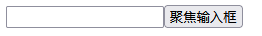

# 脱围

### ref

如果想要记住某个变量，但是不想每次改变值就触发重新渲染，那么就用`ref`代替`state`

```js
//App.js
import { useRef } from 'react';

export default function Counter() {
  let ref = useRef(0);

  function handleClick() {
    ref.current = ref.current + 1;
    alert('你点击了 ' + ref.current + ' 次！');  //每点击一次显示的点击次数都加一
  }

  return (
    <button onClick={handleClick}>
      点击我！  
    </button>
  );
}

```

### ref控制DOM

```js
import { forwardRef, useRef } from 'react';

const MyInput = forwardRef((props, ref) => {
    return <input {...props} ref={ref} />;
});

export default function Form() {
    const inputRef = useRef(null);

    function handleClick() {
        inputRef.current.focus();
    }

    return (
        <>
            <MyInput ref={inputRef} />
            <button onClick={handleClick}>
                聚焦输入框
            </button>
        </>
    );
}
```

点击“聚焦输入框”按钮可以使输入框聚焦



### Effect

- effect会在每一次渲染后立刻被调用，可以用effect包装一些不允许在渲染期间做的操作
- 可以为effect加入依赖数组，这样effect只会在依赖数组之内的值有更改的时候才调用，避免不必要的运行

```js
import { useState, useRef, useEffect } from 'react';

function VideoPlayer({ src, isPlaying }) {
    const ref = useRef(null);

    useEffect(() => {
        if (isPlaying) {
            ref.current.play();
        } else {
            ref.current.pause();
        }
    }, [isPlaying]);

    return <video ref={ref} src={src} loop  />;
}

export default function App() {
    const [isPlaying, setIsPlaying] = useState(false);
    const [text, setText] = useState('');
    return (
        <>
            <button onClick={() => setIsPlaying(!isPlaying)}>
                {isPlaying ? 'Pause' : 'Play'}
            </button>
            <br/>
            <VideoPlayer
                isPlaying={isPlaying}
                src="./flower.mp4"
            />
        </>
    );
}
```


