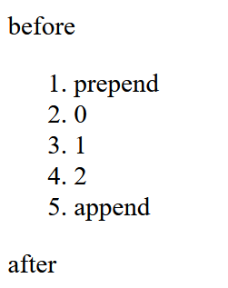
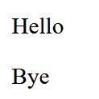

# Document

## DOM树

```html
<!DOCTYPE HTML>
<html>
<head>
  <title>About elk</title>
</head>
<body>
  The truth about elk.
</body>
</html>
```

head前面的内容会被忽略，body后面的内容会被移到body里面，其他的任何内容都会显示在树中，包括换行和空格


- html标签在js中为`document.documentElement`
- body标签在js中为`document.body`
- ele.`childNodes`返回的是ele根据DOM树的结果获取的子节点的集合（可以用for of）

- `parentNode`返回的是父节点
- `nextSibling`返回下一个兄弟节点，`previousSibling`返回上一个兄弟节点

## 纯元素导航

如果想要只获取元素而不考虑注释和文本，那么可以使用纯元素导航

- `children`返回是元素子节点
- `firstElementChild`，`lastElementChild`返回第一个、最后一个子元素
- `previousElementSibling`，`nextElementSibling`返回前一个、后一个兄弟元素
- `parentElement` 返回父元素

## document允许使用js修改页面

```js
document.body.style.background = 'red'; //相当于html中设置body的背景色为红色
```

## 控制台交互

- 法一：对想要修改的内容右键检查，选中想要修改的标签后按下`Esc`打开控制台，选中的对象可以用`$0`操作

```js
$0.style.background = 'red'   //修改对应标签的背景色为红色
```

- 法二：F12打开控制台，输入`document.body`后可以用 `$0`操作body

```js
$0.style.background = 'red'   //修改整个html的body背景色为红色
```

## 搜索

### id搜索

- id搜索函数

```js
//获取id为ele-content的标签，将其背景改为红色
let ele = document.getElementById('elem-content');
ele.style.background = 'red';
```

- id直接搜索

```js
elem.style.background = 'red'; //获取id为elem的标签，将其背景改为红色
```

- window搜索id

带有某些符号的id无法用直接搜索的方式获取，可以用window的方式

```js
window['ele-content'].style.background = 'red'; //获取id为ele-content的标签，将其背景改为红色
```

### CSS搜索

- querySelectorAll

```html
<body>

<ul>
  <li>The</li>
  <li>test</li>
</ul>
<ul>
  <li>has</li>
  <li>passed</li>
</ul>

<script>
  let elements = document.querySelectorAll('ul > li:last-child');

  for (let elem of elements) {
    alert(elem.innerHTML); // test, passed
  }
</script>

</body>
</html>
```

- 如果是querySelector则只会返回第一个结果

```html
<body>
<ul>
  <li>The</li>
  <li>test</li>
</ul>
<ul>
  <li>has</li>
  <li>passed</li>
</ul>

<script>
  let ele = document.querySelector('ul > li:last-child');
  alert(ele.innerHTML); // passed
</script>

</body>
</html>
```

- 过滤搜索

```html
<body>
<a href="http://example.com/file.zip">...</a>
<script>
  
  for (let elem of document.body.children) {
    if (elem.matches('a[href$="zip"]'))  { //找到以zip结尾的a标签
      alert("The archive reference: " + elem.href );  //The archive reference: http://example.com/file.zip
    }
  }
</script>

</body>
</html>
```

- 父级标签搜索

```html
<body>

<div class="contents">
  <ul class="book">
    <li class="chapter">Chapter 1</li>
  </ul>
</div>

<script>
  let chapter = document.querySelector('.chapter'); // 获取chapter类的标签
  alert(chapter.closest('.book')); // UL （搜索父级中类名为book的最近标签）
  alert(chapter.closest('.contents')); // DIV
</script>

</body>
</html>
```

## html特性与属性

非标准的特性需要用函数获取

```html
<body something="non-standard">
  <script>
    alert(document.body.getAttribute('something')); // non-standard
  </script>
</body>
```

以属性的形式修改特性，然而有些特性无法利用属性修改，例如input标签的value

```html
<input>
<script>
  let input = document.querySelector('input');
  // 特性 => 属性
  input.setAttribute('value', 'text');  //设置value特性的值为text
  alert(input.value); // text

  // 这个操作无效，属性 => 特性
  input.value = 'newValue';
  alert(input.getAttribute('value')); // text（没有被更新）
</script>
```

直接用js的`elem.style.*`获取的不是html特性而是js属性，为了获取html特性，需要使用专门的方法

```html
<head>
    <style>
        body {
            color: red; margin: 5px
        }
    </style>
</head>
<body>
<script>
    let computedStyle = getComputedStyle(document.body);
    alert(computedStyle.margin);  //5px
</script>
</body>
```

## 修改文档内容

一份html中含有如下的列表

```js
<ol id="ol">
  <li>0</li>
  <li>1</li>
  <li>2</li>
</ol>
```


节点创造（文本式）

```js
<script>
  ol.before('before'); 
  ol.after('after');

  let liFirst = document.createElement('li');
  liFirst.innerHTML = 'prepend';
  ol.prepend(liFirst); // 将 liFirst 插入到 <ol> 的最开始

  let liLast = document.createElement('li');
  liLast.innerHTML = 'append';
  ol.append(liLast); // 将 liLast 插入到 <ol> 的最末尾
</script>
```



节点创造（html式）

insertAdjacentHTML第一个参数的四种可能：

- beforebegin: 在当前元素本身的前面。如果当前元素是 div，那么新的 HTML 会被插入到这个 div 的前面，作为 div 的兄弟节点。  
- afterbegin: 在当前元素的内容的前面。如果当前元素是 div，那么新的 HTML 会被插入到这个 div 的内容的最前面，作为 div 的第一个子节点。
- beforeend: 在当前元素的内容的后面。如果当前元素是 div，那么新的 HTML 会被插入到这个 div 的内容的最后面，作为 div 的最后一个子节点。
- afterend: 在当前元素本身的后面。如果当前元素是 div，那么新的 HTML 会被插入到这个 div 的后面，作为 div 的兄弟节点。

```html
<!doctype html>
<body>
<div id="div1"></div> 
<script>
  div1.insertAdjacentHTML('beforebegin', '<p>Hello</p>');
  div1.insertAdjacentHTML('afterend', '<p>Bye</p>');
</script>
</body>
```



节点移除

```js
nodeName.remove();
```

## 样式与类

css中的类以空格为间隔，js可以添加或者移除类，需要用到`classList`这一特殊对象

```html
<body class="main page">
  <script>
    document.body.classList.add('article');
    alert(document.body.className); // main page article
  </script>
</body>
```

`classList`是可迭代的

```html
<body class="main page">
  <script>
    for (let name of document.body.classList) {
      alert(name); // main，然后是 page
    }
  </script>
</body>
```

elem.style.cssText对样式的完全重写

```js
elem.style.cssText = "color:red;width:100px...";
```

## 大小、滚动、坐标

### 几何属性

==几何属性的值不带px单位==

- offsetLeft：左外边距
- offsetTop：上外边距
- offsetWidth：css中的width与padding与border的和
- offsetHeight：css中的height与padding与border的和
- clientTop：上边框的宽度（如果上面有横向的滚动条，则还需要加上滚动条的宽度）
- clientLeft：左边框的宽度（如果左边有竖向的滚动条，则还需要加上滚动条的宽度）
- clientWidth：css中的width与padding的和（如果有滚动条和内容width重合了，那么还需要去掉滚动条的宽度）
- clientHeight：css中的height与padding的和（如果有滚动条和内容width重合了，那么还需要去掉滚动条的宽度）
- scrollWidth和scrollHeigh：同client，但如果有滚动条，这里的宽、高代表能滚动出来的全部部分的宽高
- scrollLeft：横向滚动条已经滚动的距离

### 浏览器窗口

- window.scrollX表示当下窗口已经在X轴滚动的距离
- window.scrollY表示当下窗口已经在Y轴滚动的距离
- window.scrollBy(x,y)表示自动滚动窗口，使得X轴滚动x，Y轴滚动y
- window.scrollTo(x,y)表示自动滚动窗口，使得X轴已经的滚动距离为x，Y轴已经滚动的距离为y
- elem.scrollIntoView()滚动窗口让elem处于窗口最上方
- elem.scrollIntoView(false)滚动窗口让elem处于窗口最下方
