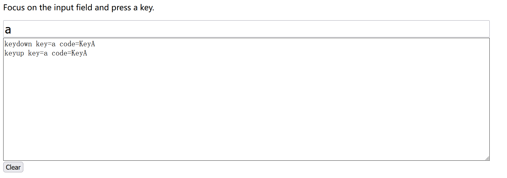

# UI事件

### 鼠标点击

- 按下鼠标触发`mousedown`松开触发`mouseup`如果是左键，`mouseup`后面还会触发`click`  如果是右键则触发`contextmenu`

- 事件信息记录
  `event.botton`记录鼠标按键 ` 0`为左键 `2`为右键
  `event.shiftKey、event.ctrlKey、event.altKey`分别记录对应按键是否按下

### 鼠标移动

- `mouseover`会冒泡，如果从父级容器移动到子级容器，父级会先触发`mouserout(target是父级)`然后触发`mouseover(target是子级)`-

- `mouseout`也会冒泡，`relatedTarget`是移动的目标元素

  利用冒泡的特性可以做事件委托

```html
<table id="myTable">
    <tr>
        <th colspan="2">Table</th>  <!--   表头跨越两列     -->
    </tr>
    <tr>
        <td>
            <strong>Northwest</strong>
            <br>Silver
        </td>
        <td>
            <strong>North</strong>
            <br>Water
        </td>
    </tr>
    <tr>
        <td>
            <strong>West</strong>
            <br>Gold
        </td>
        <td>
            <strong>Center</strong>
            <br>Harmony
        </td>
    </tr>
</table>
<script>
    let currentElem = null;
    myTable.onmouseover = function(event) {
        if (currentElem) return;  //同一块的内部移动（strong标签和br后面的文本之间的移动）不处理
        let target = event.target.closest('td');
        if (!target) return;  //只需要td标签变色
        currentElem = target;
        currentElem.style.background = 'pink';
    };
    myTable.onmouseout = function(event) {
        let relatedTarget = event.relatedTarget;  
        while (relatedTarget) {
            if (relatedTarget == currentElem) return;  //移出去的目标是子结点时不处理
            relatedTarget = relatedTarget.parentNode; //向上溯所有的祖先结点
        }
        currentElem.style.background = "";
        currentElem = null;
    };
</script>
```

- `mouseenter`和`mouseleave`不会冒泡

### 键盘事件

`keydown`和`keyup`分别表示按下和送开键盘

- `event.type`代表事件的类型
- `event.key`表示实际输入的值
- `event.code`表示值对于的代码
- `event.shiftKey、event.ctrlKey、event.altKey`分别代表对应的功能键有无按下

```html
<head>
    <meta charset="utf-8">
    <style>
        #kinput {
            font-size: 150%;
            box-sizing: border-box;
            width: 95%;
        }
        #area {
            width: 95%;
            box-sizing: border-box;
            height: 250px;
            border: 1px solid black;
            display: block;
        }
    </style>
</head>

<body>

<form id="form" onsubmit="return false">

    <p>Focus on the input field and press a key.</p>

    <input type="text" placeholder="Press keys here" id="kinput">

    <textarea id="area" readonly></textarea>
    <input type="button" value="Clear" onclick="area.value = ''" />
</form>
<script>
    kinput.onkeydown = kinput.onkeyup = handle;
    let lastTime = Date.now();
    function handle(e) {

        let text = e.type +
            ' key=' + e.key +
            ' code=' + e.code +
            (e.shiftKey ? ' shiftKey' : '') +
            (e.ctrlKey ? ' ctrlKey' : '') +
            (e.altKey ? ' altKey' : '') +
            "\n";
        if (area.value && Date.now() - lastTime > 250) {
            area.value += new Array(81).join('-') + '\n';  //八十个'-'加一个换行
        }
        lastTime = Date.now();
        area.value += text;
    }
</script>

</body>
```

