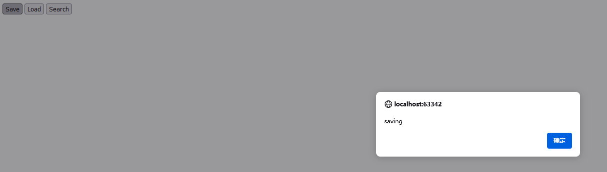
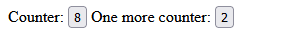
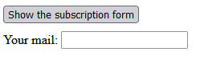
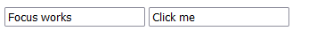
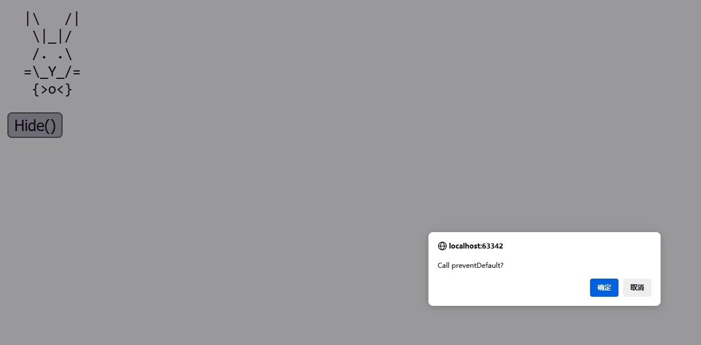

# 事件

## 点击触发函数

- html特性`onclick`

```html
<input value="Click me" onclick="alert('Click!')" type="button"> <!--按下按钮会执行alert函数-->
```

- DOM属性`onclick`

```html
<div id="test">
    <p>tes</p>
</div>
<!--点击文字tes就可以触发函数alert-->
<script>
    test.onclick = function() {
        alert('hell');
    };
</script>
```

- 监听`onclick`

```html
<div id="test">
    <p>tes</p>
</div>
<script>
    function handler() {
        alert( 'Thanks!' );
    }
    test.addEventListener("click", handler);
    //五秒后去掉监听，注添加和删除监听的函数必须完全一样而不是内容一样，所以这里用同一个函数（handler）
    setTimeout(() => test.removeEventListener("click", handler), 5000);
</script>
```

## 冒泡阶段

事件会从子标签冒泡到父标签，一直到html再到document，有些事件甚至会冒泡到window，但可以提前终止冒泡

```html
<body onclick="alert(`the bubbling doesn't reach here`)">
  <button onclick="event.stopPropagation()">Click me</button> <!--按下按钮时不会冒泡导致body对应的alert被触发-->
</body>
```

## 捕获阶段

事件发生时，第一阶段是捕获阶段，从window到document到body...一直到目标标签，到了目标标签后对它触发事件，然后从它开始向上冒泡
`addEventListener`的第三个参数写true表示捕获阶段执行第二个参数传入的函数，写false或者不写就是在冒泡阶段执行第二个参数传入的函数

## 事件委托

- 同一个祖先的程序处理多个子结点


一份table下面有四块

```html
<table id="myTable">
    <tr>
        <th colspan="2">Table</th>  <!--   表头跨越两列     -->
    </tr>
    <tr>
        <td><strong>Northwest</strong>
            <br>Silver
        </td>
        <td><strong>North</strong>
            <br>Water
        </td>
    </tr>
    <tr>
        <td><strong>West</strong>
            <br>Gold
        </td>
        <td><strong>Center</strong>
            <br>Harmony
        </td>
    </tr>
</table>
```

点击任意一块，它都会变红，通过添加和删除类（highlight）来实现

```css
.highlight{
    background: red;
}
```

```js
    let selectedTd;
    function highlight(td) {
        if (selectedTd) { // 移除现有的高亮显示，如果有的话
            selectedTd.classList.remove('highlight');
        }
        selectedTd = td;
        selectedTd.classList.add('highlight'); // 高亮显示新的 td
    }
    myTable.onclick = function(event) {
        let target = event.target;
        if (target.tagName != 'TD') return;  // 只让td标签变色
        highlight(target);
    };
```

- 利用类的思想做组件

```html
<div id="menu">
  <button data-action="save">Save</button>
  <button data-action="load">Load</button>
  <button data-action="search">Search</button>
</div>

<script>
  class Menu {
    constructor(elem) {
      this._elem = elem;
      elem.onclick = this.onClick.bind(this); // (*)
    }

    save() {
      alert('saving');
    }

    load() {
      alert('loading');
    }

    search() {
      alert('searching');
    }

    onClick(event) {
      let action = event.target.dataset.action; //bataset.获取的是data-
      if (action) {
        this[action]();
      }
    };
  }
  new Menu(menu);  //将id为menu的块创建为Menu的实例
</script>
```



点击按钮就会显示对应的文本

## 行为模式

利用特性筛选需要做操作的对象

- 计数器

```html
Counter: <input type="button" value="1" data-counter>
One more counter: <input type="button" value="2">

<script>
    document.addEventListener('click', function(event) {

        if (event.target.dataset.counter != undefined) { // 如果这个特性存在...
            event.target.value++;
        }
    });
</script>
```



第一个counter被点击就会+1 而另外一个不会

- 切换器

```html
<button data-toggle-id="subscribe-mail">
    Show the subscription form
</button>

<form id="subscribe-mail" hidden style="margin-top: 10px;">
    Your mail: <input type="email">
</form>

<script>
    document.addEventListener('click', function(event) {
        let id = event.target.dataset.toggleId;  //dataset.选择的对象会自动加-  这里选择的就是data-toggle-id
        if (!id) return;

        let elem = document.getElementById(id);

        elem.hidden = !elem.hidden;  //展开状态点击就收起，收起状态点击就展开
    });
</script>
```



## 截断事件

对于具有前后关系的事件，如果在前者发生时终止默认行为，那么后者不会发生，比如需要onmousedown才能onfocus

```html
<input value="Focus works" onfocus="this.value=''">
<input onmousedown="return false" onfocus="this.value=''" value="Click me">
```

需要选中了输入框才能触发onfocus，才能让框内的内容变为空，但是如果直接点击第二个框，就会把这个框的默认行为被终止，就不会有后面的事件（让this.value为空）发生了，这里只能先点击第一个框，然后Tab换到第二个框才能实现让它的内容变空的效果



## 自定义事件

自定义事件添加`bubbles`为true表示这个行为可以冒泡，这里对id为elem的对象运行event（hello行为），一路向上冒泡，而`document`有监听hello行为，所以冒泡到document的时候会执行alert，而`event.target.tagName`返回的是实际触发行为的对象的标签，即h1
`new Event`创建的自定义事件只能传入`bubbles`和`cancelable`代表是否可以冒泡和是否可以取消默认行为，如果要加入其它参数，就不能用`new Event`

```html
<h1 id="elem">Test</h1>

<script>

    document.addEventListener("hello", function(event) { 
        alert("Hello from " + event.target.tagName); 
    });
    
    let event = new Event("hello", {bubbles: true}); // 
    elem.dispatchEvent(event);
    //显示Hello from H1
</script>
```

`preventDefault`传递阻止自定义事件的信息

```html
<pre id="rabbit">
  |\   /|
   \|_|/
   /. .\
  =\_Y_/=
   {>o<}
</pre>
<button onclick="hide()">Hide()</button>

<script>
    function hide() {
        let event = new CustomEvent("hide", {
            cancelable: true 
        });
        if (!rabbit.dispatchEvent(event)) {
            alert('The action was prevented by a handler');
        } else {
            rabbit.hidden = true;
        }
    }

    rabbit.addEventListener('hide', function(event) {
        if (confirm("Call preventDefault?")) {
            event.preventDefault();
        }
    });
</script>
```

按钮被点击时调用hide函数创建一个可取消默认行为的事件`hide`  而rabbit会监听`hide` 监听到`hide`后执行对应的函数显示出一个确认框，如果用户确认，就让`hide`事件被`preventDefault`终止，那么rabbit运行事件就会返回false
总效果：按下hide按钮后，如果选择确认，那么就无法隐藏兔子，如果取消就可以隐藏兔子



