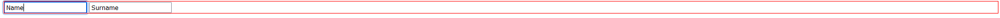
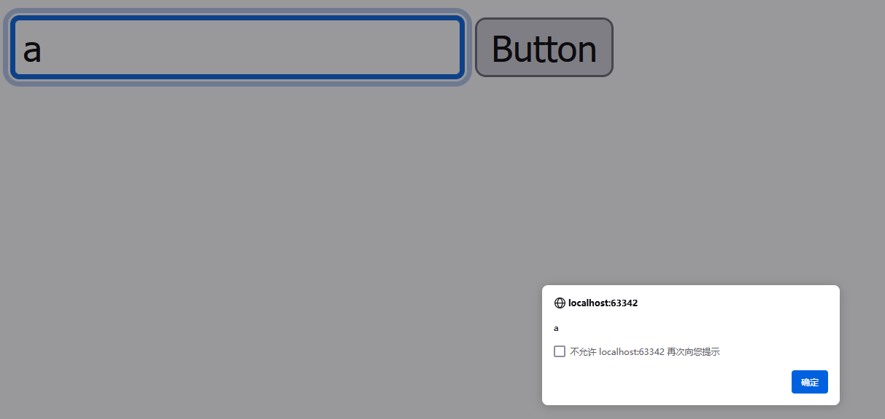
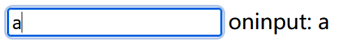
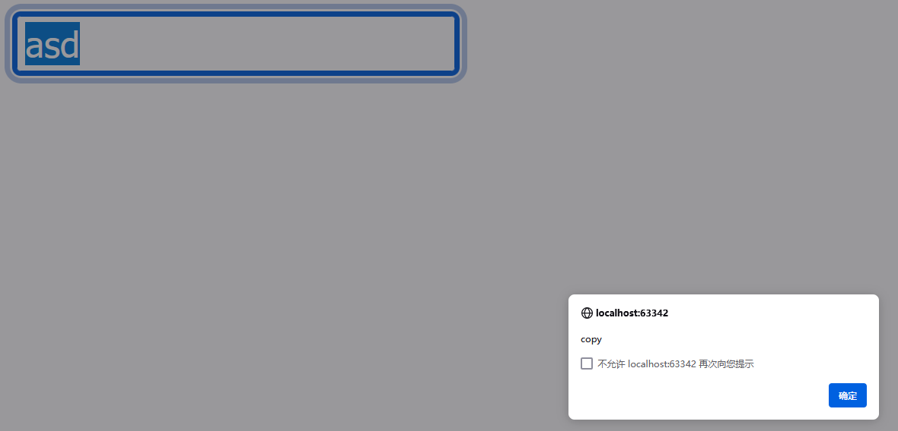
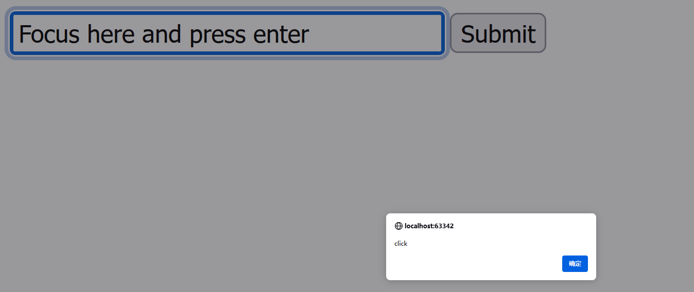

# 表单

### 表单的html标签

```html
<form>
    <fieldset> <!--分区管理表格-->
        <legend>个人信息</legend> <!--分区的头标题-->
        <label for="name">姓名:</label> <!--input前的标识-->
        <input type="text" id="name" name="name"><br><br>
        <label for="email">电子邮件:</label>
        <input type="email" id="email" name="email"><br><br>
        <label for="age">年龄:</label>
        <input type="number" id="age" name="age"><br><br>
    </fieldset>
</form>
```


### js对表单子标签的索引

正向索引：父标签`.elements.`子标签的`name`
反索引至表单：子标签`.form`

### 事件focus/blur

- focus/blur不会冒泡，但是会在捕获阶段向下传递

```html
<form id="form">
  <input type="text" name="name" value="Name">
  <input type="text" name="surname" value="Surname">
</form>
<style> .focused { outline: 1px solid red; } </style>
```



利用捕获实现选中任意一个框都会使得整个form外面出现红框，失焦则去掉红框

```js
form.addEventListener("focus", () => form.classList.add('focused'), true);
form.addEventListener("blur", () => form.classList.remove('focused'), true);
```

- 对象`.focus()`使其获焦


以下的代码实现email输入框，如果输入的内容没有@就已经失焦（鼠标点击了别处） 那么就显示错误提示，获得焦时又去掉错误提示

```html
<style>
  .invalid { border-color: red; }
  #error { color: red }
</style>
Your email please: <input type="email" id="input">
<div id="error"></div>
```

```js
    input.onblur = function() {
        if (!input.value.includes('@')) { 
            input.classList.add('invalid');
            error.innerHTML = 'Please enter a correct email.' //内嵌html
        }
    };
    input.onfocus = function() {
        if (this.classList.contains('invalid')) {
            this.classList.remove('invalid');
            error.innerHTML = "";
        }
    };
```

### 事件change

- 文本输入框，失焦时的内容与获焦时不同则会触发change事件

```html
<input type="text" onchange="alert(this.value)">
<input type="button" value="Button">
```



### 事件input

- 文本输入框，只要内容改变就会触发input事件

下面的程序在output后面实时显示文本框中的内容

```html
<input type="text" id="input"> oninput: <span id="result"></span>
```

```js
   input.oninput = function() {
        result.innerHTML = input.value;
    };
```



### 事件copy、paste、cut

下面的程序阻止复制、粘贴、裁剪并显示尝试做的操作

```html
<input type="text" id="input">
```

```js
     input.onpaste = input.oncut = input.oncopy = function(event) {
        alert(event.type);
        event.preventDefault();
    };
```



### 表单提交

form中写一个类型为`submit`或者`image`的`input`就可以实现点击提交的功能（触发点击事件就触发表单的提交事件）
文本框的回车也会触发`submit`框的点击事件

下面的程序实现功能：点击提交或者在文本框中按下回车都会显示click

```html
<form onsubmit="return false">
    <input type="text" size="30" value="Focus here and press enter">
    <input type="submit" value="Submit" onclick="alert('click')">
</form>
```


