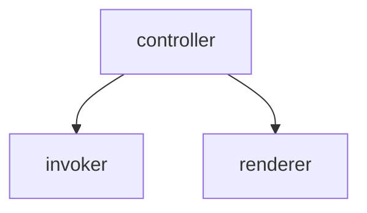
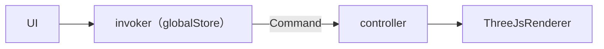

# Invoker

#### **结构**

`globalStore`中存了`controller`和`invoker`，其中，`controller`有`invoker`的控制权



UI存储变量用作`offset`，ThreeJsRenderer存储变量记录实际数据
`command`内部更新UI的变量，并调用controller来调用ThreeJsRenderer的方法

**流程图（以更新缩放为例）**




#### ThreejsRenderer

提供函数实现模型的更新

 ```tsx
   public moveModel(value: number, index: number) {
     const newVal = this.originPosition[index] + value
     if (this.object) {
       if (index === 0) {
         this.object.position.x = newVal
       } else if (index === 1) {
         this.object.position.y = newVal
       } else if (index === 2) {
         this.offsetZ = this.originoffsetZ + value
       }
 
       this.object.updateMatrixWorld()
       this.convexHull.matrix = this.object.matrix.clone()
       if (this.baseModel) {
         this.baseBox.setFromObject(this.baseModel)
         this.object.position.z -= this.findMinZ() - this.baseBox.max.z + this.offsetZ
       }
     }
   }
 ```


#### controller

在这里实现UI变量的更改以及模型的更改

```tsx
  public updateModelPosition = (value: number, index: number) => {
    const newPosition = [...this.store.modelPosition]
    newPosition[index] = value
    this.store.setModelPosition(newPosition)
    this.renderer.moveModel(value, index)
  }
```


#### 封装command

不要在前端以参数的形式给`Command`传入前后状态，而是在`Command`中直接取得需要的参数。

```tsx
import { throws } from 'assert'
import { ICommand, getController } from './Command'
import { useEditorStore } from '@src/stores/editorStore'

export class Move implements ICommand {
  prePosition: number
  curPosition: number
  index: number
  public constructor(value: number, index: number) {
    this.prePosition = value
    this.index = index
    this.curPosition = useEditorStore.getState().modelPosition[index]
  }

  execute(): void | Promise<void> {
    const controller = getController()
    if (controller) {
      controller.updateModelPosition(this.curPosition, this.index)
    }
  }

  undo(): void | Promise<void> {
    const controller = getController()
    if (controller) {
      controller.updateModelPosition(this.prePosition, this.index)
    }
  }
}

```


#### invoker执行command

```tsx
  public async execute<CMD extends ICommand, T extends Array<any>>(
    // @ts-ignore
    type: { new (...T): CMD },
    ...args: T
  ) {
    const cmd = new type(...args)
    await cmd.execute()

    this.undoStack.push(cmd)
    this.redoStack = []
    this.updateStack()
  }
```


#### UI触发

这里传入发送变化前一个瞬间的值，当下的值可以在发生变化后从全局存储文件中直接获取

```tsx
invoker.execute(Move, value, index)
```


#### 完整代码

##### Controller.ts

```ts
import { useEditorStore } from '@src/stores/editorStore'
import { Invoker } from './Invoker'
import ThreeJsRenderer from './ThreeJsRenderer'
import { EditorContext } from './EditorContext'

type Props = {
  context: EditorContext
  canvas: HTMLCanvasElement
  cubeCanvas: HTMLCanvasElement
}

export class Controller {
  public invoker: Invoker
  private renderer: ThreeJsRenderer
  private context: EditorContext

  public constructor({ context, canvas, cubeCanvas }: Props) {
    this.invoker = new Invoker()
    this.context = context
    this.renderer = new ThreeJsRenderer({ canvas, context: this.context, cubeCanvas })

    if (this.context.modelUrl) {
      this.renderer.updateModel(this.context.modelUrl, this.context.modelTextureUrl)
    } else {
      console.error('Model url should not be empty!')
    }
  }

  public dispose() {
    this.renderer.dispose()
    this.store.reset()
  }

  private get store() {
    return useEditorStore.getState()
  }

  private get bodyColor() {
    const { quantizedNum, quantizedInfos } = this.store
    if (!quantizedInfos || quantizedNum === undefined) {
      return []
    }

    const quantizedInfo = quantizedInfos.find((item) => item.colorNum === quantizedNum)
    return quantizedInfo?.bodyColor ?? []
  }

  private get eyeColor() {
    const { quantizedNum, quantizedInfos } = this.store
    if (!quantizedInfos || quantizedNum === undefined) {
      return []
    }

    const quantizedInfo = quantizedInfos.find((item) => item.colorNum === quantizedNum)
    return quantizedInfo?.eyeColor ?? []
  }

  public getCurrentQuantization() {
    if (!this.context.modelTextureUrl || !this.store.quantizedNum) {
      return {
        quantizedNum: 0,
        bodyColor: [],
        eyeColor: [],
        textureUrl: this.context.modelTextureUrl ?? '',
      }
    }

    return {
      textureUrl: this.context.quantizedModelTextureUrl ?? this.context.modelTextureUrl,
      quantizedNum: this.store.quantizedNum,
      bodyColor: this.bodyColor,
      eyeColor: this.eyeColor,
    }
  }

  public updateEyeResources(eyeModelUrls: string[][]) {
    this.context.eyeModelUrls = eyeModelUrls
  }

  public updateEyeModel(index: number) {
    this.context.selectedEyeIndex = index
    if (index >= 0 && index < this.context.eyeModelUrls.length) {
      this.renderer.updateEyeModel(this.context.eyeModelUrls[this.context.selectedEyeIndex])
    } else {
      if (index !== -1) {
        console.error('Invalid eye index!')
      }
      this.renderer.updateEyeModel([])
    }
  }

  public onCanvasResize() {
    this.renderer.onCanvasResize()
  }

  public updateBaseModel(baseUrl: string) {
    this.renderer.updateBaseModel(baseUrl)
  }

  public updateModelPosition = (value: number, index: number) => {
    const newPosition = [...this.store.modelPosition]
    newPosition[index] = value
    this.store.setModelPosition(newPosition)
    this.renderer.moveModel(value, index)
  }

  public updateModelRotation = (value: number, index: number) => {
    const newRotation = [...this.store.modelRotation]
    newRotation[index] = value
    this.store.setModelRotation(newRotation)
    this.renderer.rotateModel(value, index)
  }

  public updateModelScale = (value: number, index: number) => {
    const newScale = [...this.store.relativelyScale]
    newScale[index] = value
    this.store.setRelativelyScale(newScale)
    this.renderer.scaleModel(value, index)
  }
  public resetModel = () => {
    this.store.setModelPosition(new Array(3).fill(parseFloat(this.store.subjectInits[0])))
    this.store.setModelRotation(new Array(3).fill(parseFloat(this.store.subjectInits[1])))
    this.store.setRelativelyScale(new Array(3).fill(parseFloat(this.store.subjectInits[2])))
    this.store.setOverallScale(new Array(1).fill(parseFloat(this.store.overallInits[0])))
    this.renderer.resetModel()
  }
  public resetUndo = (
    prePosition: number[],
    preRotation: number[],
    preScale: number[],
    preScaleOverall: number[]
  ) => {
    this.store.setModelPosition(prePosition)
    this.store.setModelRotation(preRotation)
    this.store.setRelativelyScale(preScale)
    this.store.setOverallScale(preScaleOverall)
    this.renderer.resetUndo(prePosition, preRotation, preScale, preScaleOverall)
  }
  public lockedScale = (scale: number) => {
    this.store.setOverallScale([scale])
    this.renderer.lockedScale(scale)
  }
  public lockedcaleModel = (scales: number[]) => {
    this.store.setRelativelyScale(scales)
    this.renderer.lockedScaleModel(scales)
  }
  public updateCameraAngle(azimuthal: number, polar: number) {
    this.renderer.updateCameraAngle(azimuthal, polar)
  }

  public clearCameraCubeMesh() {
    this.renderer.clearCameraCubeMesh()
  }

  public updatePokemonTexture(textureUrl: string) {
    this.context.updateTextureUrl(textureUrl)
    this.renderer.updatePokemonTexture(textureUrl)
  }

  public updateEyeColor(colorList: string[]) {
    this.renderer.updateEyeColor(colorList)
  }

  public updatePaletteInfos({
    originColorKey,
    options,
  }: {
    originColorKey: string
    options?: Partial<FilamentInfo>
  }) {
    this.store.updateFilamentInfo(originColorKey, { ...options })
    this.updateTextureColor(this.store.filamentList)
  }

  public deletePalette({ colorKey, newColorKey }: { colorKey: string; newColorKey: string }) {
    this.store.updateFilamentInfo(colorKey, { deleted: true, sourceKey: newColorKey })
    this.updateTextureColor()
  }

  private async updateTextureColor(filamentList = this.store.filamentList) {
    const textureUrl = await this.context.updateTextureColor(filamentList)
    if (textureUrl) {
      this.renderer.updatePokemonTexture(textureUrl)
    }
  }

  public updateQuantization({
    bodyColor,
    quantizedNum,
    originFilamentColorList,
    textureUrl,
  }: {
    bodyColor: string[]
    quantizedNum: number
    originFilamentColorList?: FilamentInfo[]
    textureUrl: string
  }) {
    const { setFilamentColorList, setQuantizedNum } = this.store
    setFilamentColorList(
      originFilamentColorList ??
        bodyColor.map((v) => {
          return {
            key: v,
            color: v,
          }
        })
    )
    setQuantizedNum(quantizedNum)
    this.context.updateTextureUrl(textureUrl)
    this.updateTextureColor()
  }
}

```


##### Command.ts

```ts
import { useGlobalStore } from '@src/stores/globalStore'
import { Controller } from '../Controller'
export interface ICommand {
  execute(): void | Promise<void>
  undo(): void | Promise<void>
}

export function getController(): Controller | undefined {
  const { controller } = useGlobalStore.getState()
  return controller
}

```


##### Invoker.ts

```ts
import { useEditorStore } from '@src/stores/editorStore'
import { ICommand } from './commands/Command'

export class Invoker {
  undoStack: ICommand[] = []
  redoStack: ICommand[] = []

  public constructor() {}

  public async executeCmd(cmd: ICommand) {
    await cmd.execute()
    this.undoStack.push(cmd)
    this.redoStack = []
    this.updateStack()
  }

  public async batchExecute<CMD extends ICommand, T extends Array<any>>(
    // @ts-ignore
    type: { new (...T): CMD },
    selectedIndexes: number[],
    ...args: T
  ) {
    const cmd = new type(selectedIndexes, ...args)
    await cmd.execute()

    this.undoStack.push(cmd)
    this.redoStack = []
    this.updateStack()
  }

  public redo(): Promise<ICommand> | undefined {
    if (this.redoStack.length === 0) {
      return
    }

    const toRedo = this.redoStack.pop() as ICommand
    const res = toRedo.execute()
    const handleRes = () => {
      this.undoStack.push(toRedo)
      this.updateStack()
    }

    if (res instanceof Promise) {
      return new Promise<ICommand>((resolve) => {
        res.then(() => {
          handleRes()
          resolve({ ...toRedo })
        })
      })
    } else {
      handleRes()
      return new Promise<ICommand>((resolve) => resolve({ ...toRedo }))
    }
  }

  public undo(): Promise<ICommand> | undefined {
    if (this.undoStack.length === 0) {
      return
    }
    const toUndo = this.undoStack.pop() as ICommand
    const res = toUndo?.undo()
    const handleRes = () => {
      this.redoStack.push(toUndo)
      this.updateStack()
    }
    if (res instanceof Promise) {
      return new Promise<ICommand>((resolve) => {
        res.then(() => {
          handleRes()
          resolve({ ...toUndo })
        })
      })
    } else {
      handleRes()
      return new Promise<ICommand>((resolve) => resolve({ ...toUndo }))
    }
  }

  public updateStack() {
    useEditorStore.getState().updateStack(this.undoStack.length, this.redoStack.length)
    const { setUndoDisabled, setRedoDisabled } = useEditorStore.getState()
    setUndoDisabled(this.undoStack.length === 0)
    setRedoDisabled(this.redoStack.length === 0)
  }

  public async execute<CMD extends ICommand, T extends Array<any>>(
    // @ts-ignore
    type: { new (...T): CMD },
    ...args: T
  ) {
    const cmd = new type(...args)
    await cmd.execute()
    this.undoStack.push(cmd)
    this.redoStack = []
    this.updateStack()
  }

  private async genericChangeCommand<COMMAND extends ICommand, T extends any[]>(
    type: new (...constructorArgs: T) => COMMAND,
    ...constructorArgs: T
  ) {
    const cmd = new type(...constructorArgs)
    await cmd.execute()
    this.undoStack.push(cmd)
    this.redoStack = []
    this.updateStack()
  }
}

```


