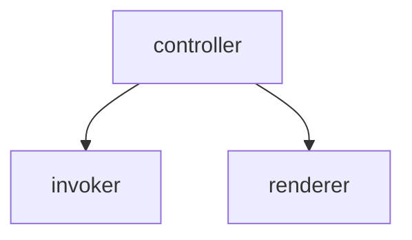
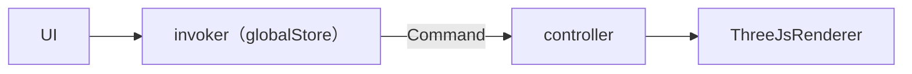

# Invoker

**结构**

`globalStore`中存了`controller`和`invoker`，其中，`controller`有`invoker`的控制权




**流程图（以更新缩放为例）**




#### ThreejsRenderer

提供函数实现模型的更新

 ```tsx
   public moveModel(value: number, index: number) {
     const newVal = this.originPosition[index] + value
     if (this.object) {
       if (index === 0) {
         this.object.position.x = newVal
       } else if (index === 1) {
         this.object.position.y = newVal
       }
     }
   }
 ```


#### controller

调用renderer的函数

```tsx
  public updateModelPosition = (value: number, index: number) => {
    this.renderer.moveModel(value, index)
  }
```


#### 封装command

不要在前端以参数的形式给`Command`传入前后状态，而是在`Command`中直接取得需要的参数，`Command.ts`作为基础，其中包含了获取`controller`的方法，如果实例`Command`需要调用到`controller`，那么就调用这个方法

```tsx
import { ICommand, getController } from './Command'
import { useEditorStore } from '@src/stores/editorStore'

export class Move implements ICommand {
  prePosition: number[]
  value: number
  index: number
  public constructor(value: number, index: number) {
    const { modelPosition } = useEditorStore.getState()
    this.prePosition = [...modelPosition]
    this.prePosition[index] = value
    this.value = modelPosition[index]
    this.index = index
  }

  execute(): void | Promise<void> {
    const controller = getController()
    const { setModelPosition } = useEditorStore.getState()
    if (controller) {
      controller.updateModelPosition(this.value, this.index)
      const curPosition = [...this.prePosition]
      curPosition[this.index] = this.value
      setModelPosition(curPosition)
    }
  }

  undo(): void | Promise<void> {
    const controller = getController()
    const { setModelPosition } = useEditorStore.getState()
    if (controller) {
      controller.updateModelPosition(this.prePosition[this.index], this.index)
      setModelPosition(this.prePosition)
    }
  }
}

```


#### invoker执行command

```tsx
  public async execute<CMD extends ICommand, T extends Array<any>>(
    // @ts-ignore
    type: { new (...T): CMD },
    ...args: T
  ) {
    const cmd = new type(...args)
    await cmd.execute()

    this.undoStack.push(cmd)
    this.redoStack = []
    this.updateStack()
  }
```


#### UI触发

```tsx
invoker.execute(Move, value, index)
```


#### 完整代码

##### Controller.ts

```ts
import { useEditorStore } from '@src/stores/editorStore'
import { Invoker } from './Invoker'
import ThreeJsRenderer from './ThreeJsRenderer'
import { EditorContext } from './EditorContext'
import * as THREE from 'three'

type Props = {
  context: EditorContext
  canvas: HTMLCanvasElement
  cubeCanvas: HTMLCanvasElement
}

export class Controller {
  public invoker: Invoker
  private renderer: ThreeJsRenderer
  private context: EditorContext

  public constructor({ context, canvas, cubeCanvas }: Props) {
    this.invoker = new Invoker()
    this.context = context
    this.renderer = new ThreeJsRenderer({ canvas, context: this.context, cubeCanvas })

    if (this.context.modelUrl) {
      this.renderer.updateModel(this.context.modelUrl, this.context.modelTextureUrl)
    } else {
      console.error('Model url should not be empty!')
    }
  }

  public dispose() {
    this.renderer.dispose()
    this.store.reset()
  }

  private get store() {
    return useEditorStore.getState()
  }

  public updateEyeResources(eyeModelUrls: string[][]) {
    this.context.eyeModelUrls = eyeModelUrls
  }

  public updateEyeModel(index: number) {
    this.context.selectedEyeIndex = index
    if (index >= 0 && index < this.context.eyeModelUrls.length) {
      this.renderer.updateEyeModel(this.context.eyeModelUrls[this.context.selectedEyeIndex])
    } else {
      if (index !== -1) {
        console.error('Invalid eye index!')
      }
      this.renderer.updateEyeModel([])
    }
  }

  public onCanvasResize() {
    this.renderer.onCanvasResize()
  }

  public updateBaseModel(baseUrl: string) {
    this.renderer.updateBaseModel(baseUrl)
  }

  public updateModelPosition = (value: number, index: number) => {
    this.renderer.moveModel(value, index)
  }

  public updateModelRotation = (value: number, index: number) => {
    this.renderer.rotateModel(value, index)
  }

  public updateModelScale = (value: number, index: number) => {
    this.renderer.scaleModel(value, index)
  }
  public resetModel = () => {
    this.renderer.resetModel()
  }
  public resetUndo = () => {
    this.renderer.resetUndo()
  }
  public lockedScale(scale: number) {
    this.renderer.lockedScale(scale)
  }
  public updateCameraAngle(azimuthal: number, polar: number) {
    this.renderer.updateCameraAngle(azimuthal, polar)
  }

  public clearCameraCubeMesh() {
    this.renderer.clearCameraCubeMesh()
  }
}

```


##### Command.ts

```ts
import { useGlobalStore } from '@src/stores/globalStore'
import { Controller } from '../Controller'
export interface ICommand {
  execute(): void | Promise<void>
  undo(): void | Promise<void>
}

export function getController(): Controller | undefined {
  const { controller } = useGlobalStore.getState()
  return controller
}

```


##### Invoker.ts

```ts
import { useEditorStore } from '@src/stores/editorStore'
import { ICommand } from './commands/Command'

export class Invoker {
  undoStack: ICommand[] = []
  redoStack: ICommand[] = []

  public constructor() {}

  public async executeCmd(cmd: ICommand) {
    await cmd.execute()
    this.undoStack.push(cmd)
    this.redoStack = []
    this.updateStack()
  }

  public async batchExecute<CMD extends ICommand, T extends Array<any>>(
    // @ts-ignore
    type: { new (...T): CMD },
    selectedIndexes: number[],
    ...args: T
  ) {
    const cmd = new type(selectedIndexes, ...args)
    await cmd.execute()

    this.undoStack.push(cmd)
    this.redoStack = []
    this.updateStack()
  }

  public redo(): Promise<ICommand> | undefined {
    if (this.redoStack.length === 0) {
      return
    }

    const toRedo = this.redoStack.pop() as ICommand
    const res = toRedo.execute()
    const handleRes = () => {
      this.undoStack.push(toRedo)
      this.updateStack()
    }

    if (res instanceof Promise) {
      return new Promise<ICommand>((resolve) => {
        res.then(() => {
          handleRes()
          resolve({ ...toRedo })
        })
      })
    } else {
      handleRes()
      return new Promise<ICommand>((resolve) => resolve({ ...toRedo }))
    }
  }

  public undo(): Promise<ICommand> | undefined {
    if (this.undoStack.length === 0) {
      return
    }
    const toUndo = this.undoStack.pop() as ICommand
    const res = toUndo?.undo()
    const handleRes = () => {
      this.redoStack.push(toUndo)
      this.updateStack()
    }
    if (res instanceof Promise) {
      return new Promise<ICommand>((resolve) => {
        res.then(() => {
          handleRes()
          resolve({ ...toUndo })
        })
      })
    } else {
      handleRes()
      return new Promise<ICommand>((resolve) => resolve({ ...toUndo }))
    }
  }

  public updateStack() {
    useEditorStore.getState().updateStack(this.undoStack.length, this.redoStack.length)
  }

  public async execute<CMD extends ICommand, T extends Array<any>>(
    // @ts-ignore
    type: { new (...T): CMD },
    ...args: T
  ) {
    const cmd = new type(...args)
    await cmd.execute()
    this.undoStack.push(cmd)
    this.redoStack = []
    this.updateStack()
  }

  private async genericChangeCommand<COMMAND extends ICommand, T extends any[]>(
    type: new (...constructorArgs: T) => COMMAND,
    ...constructorArgs: T
  ) {
    const cmd = new type(...constructorArgs)
    await cmd.execute()
    this.undoStack.push(cmd)
    this.redoStack = []
    this.updateStack()
  }
}

```


