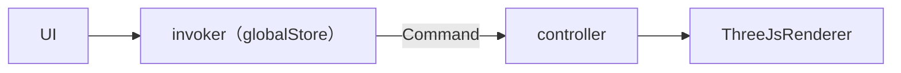

# Invoker

**流程图（以更新缩放为例）**




#### ThreejsRenderer

提供函数实现模型的更新

 ```tsx
 public scaleModel(scaleX: number, scaleY: number, scaleZ: number) {
   if (this.object) {
     this.object.scale.set(scaleX, scaleY, scaleZ);
   }
 }
 ```


#### controller

调用renderer的函数

```tsx
  public updateModelScale(scaleX: number, scaleY: number, scaleZ: number) {
    this.renderer.scaleModel(scaleX, scaleY, scaleZ)
  }
```


#### 封装conmmand

```tsx
import { ICommand, getController } from './Command'

export class ChangePosition implements ICommand {
  preScale: number[]
  curScale: number[]

  public constructor(pre: number[], cur: number[]) {
    this.preScale = pre
    this.curScale = cur
  }

  execute(): void | Promise<void> {
    const controller = getController()
    if (controller) {
      controller.updateModelScale(this.curScale[0], this.curScale[1], this.curScale[2])
    }
  }

  undo(): void | Promise<void> {
    const controller = getController()
    if (controller) {
      controller.updateModelScale(this.preScale[0], this.preScale[1], this.preScale[2])
    }
  }
}

```


#### invoker执行command

```tsx
  public async execute<CMD extends ICommand, T extends Array<any>>(
    // @ts-ignore
    type: { new (...T): CMD },
    ...args: T
  ) {
    const cmd = new type(...args)
    await cmd.execute()

    this.undoStack.push(cmd)
    this.redoStack = []
    this.updateStack()
  }
```


#### UI触发

```tsx
  const handleChangeScale = (index: number) => (e: React.ChangeEvent<HTMLInputElement>) => {
    const preScale = [relativelyScale[0], relativelyScale[1], relativelyScale[2]]
    const newScale = [...preScale]
    newScale[index] = parseFloat(e.target.value)
    invoker!.execute(ChangeModelScale, preScale, newScale)
    setRelativelyScale(newScale) //这里是一个globalStore存的变量
  }
```

