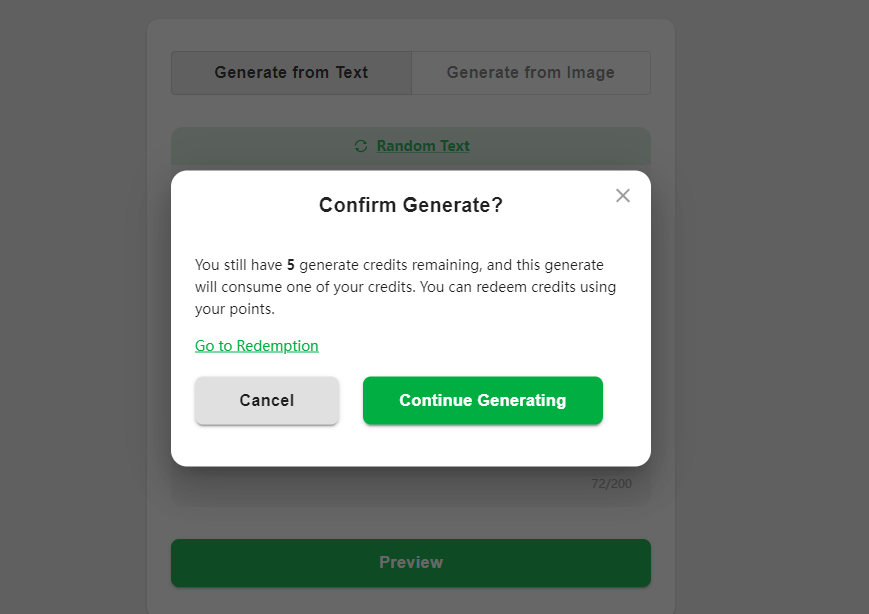
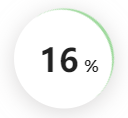

# PrintMon

### 仅父级触发事件

为了实现：当鼠标进入父级标签的时候背景变色，父级和子级之间变化时不变色，从父级出去时变色
可以用事件监听的`currentTarget`

```tsx
        onMouseEnter={(e) => {
          e.currentTarget.style.backgroundColor = 'rgba(0, 255, 0, 0.3)'
        }}
        onMouseLeave={(e) => {
          e.currentTarget.style.backgroundColor = '#d9eee1'
        }}
```


### 局部拖拽文件

需要清除整个页面的拖拽逻辑，只在需要的地方加自定义拖拽


```tsx
const handleDrop = (event) => {
    event.preventDefault();

    const file = event.dataTransfer.files[0];
    const allowedTypes = ['image/jpeg', 'image/png', 'image/webp'];
  
    if (file && allowedTypes.includes(file.type)) {
      setSelectedFile(file);
    } else {
      alert('Invalid file type. Please upload a JPG, PNG, or WEBP image.');
    }
  };

const handleDragOver = (event) => {
    event.preventDefault();
  };


  useEffect(() => {
    const handleWindowDrop = (event) => {
      event.preventDefault();
    };

    window.addEventListener('dragover', handleDragOver);
    window.addEventListener('drop', handleWindowDrop);

    return () => {
      window.removeEventListener('dragover', handleDragOver);
      window.removeEventListener('drop', handleWindowDrop);
    };
  }, []);
```


```tsx
<div 
	onDragOver={handleDragOver}
    onDrop={handleDrop}
>
    ...
</divd>
```


### 后者覆盖前者的逻辑

父级div设置`position: 'relative'`
两个子标签，第一个设置css如下：

```css
position: 'absolute';
width: 100%;
height: 100%;

```


第二子标签设置css如下：

```css
position: 'absolute';
width: 100%;
height: 100%;
left: 0;
```


**基于这个原理，可以实现css虚假加载动画**

在一个父标签下放三个标签，一个是框图，一个是最终图片，一个是白布（设置了背景色为白色）。其中，唯有框图设置`z-index: 1`。由于默认写在后面的元素会盖在前面的元素之上，所以这样可以实现伪加载的动画


**示例代码**


```tsx
          <div
            style={{
              height: '208px',
              width: '384px',
              position: 'relative',
            }}
          >
            
            
            <div
              style={{
                width: '160px',
                height: '160px',
                position: 'absolute',
                top: '15%',
                left: '50%',
                transform: 'translateX(-50%)',
                backgroundColor: 'white',
                animation: 'moveUp 3s forwards',
              }}
            ></div>
          </div>
```

```css
@moveUp{
    from{
    	top: 75%;
    }
    to{
    	top: 0;
    }
}
```


### 路径简写

在根目录下的`tsconfig.json`中添加字段`paths`

```json
{
  "compilerOptions": {
    "paths": {
      "@src/*": ["src/*"],
      "@assets/*": ["src/assets/*"],
    },
}
```


### Dialog

`Dialog`标签会出现在和`id=root`的`div`同一级



**示例代码**

```tsx
      <Dialog
        open={confirmOpen}
        id="preview-dialog"
        sx={{
          backgroundColor: "rgb(94, 94, 94, 0.3)",
          top: "50%",
          left: "50%",
          transform: "translate(-50%, -50%)",
          width: "100%",
          height: "100%",
        }}
      >
        <div
          style={{
            width: "480px",
            height: "296px",
            boxSizing: "border-box",
            borderRadius: "16px",
          }}
        >
          <IconButton
            aria-label="close"
            sx={{
              position: "absolute",
              right: 8,
              top: 5,
              color: (theme) => theme.palette.grey[500],
            }}
            onClick={() => {
              setConfirmOpen(false);
            }}
          >
            <CloseIcon />
          </IconButton>

          <DialogContent>
            <Typography
              style={{
                fontSize: "20px",
                fontWeight: "700",
                lineHeight: "28px",
                textAlign: "center",
                marginBottom: 35,
              }}
            >
              Confirm Generate?
            </Typography>
            <p
              style={{
                fontSize: "14px",
                fontWeight: "400",
                lineHeight: "22px",
              }}
            >
              You still have <strong>5</strong> generate credits remaining, and
              this generate will consume one of your credits. You can redeem
              credits using your points.
            </p>
            <a
              href="#"
              style={{
                fontSize: "14px",
                fontWeight: "400",
                lineHeight: "22px",
                color: "#00AE42",
              }}
            >
              Go to Redemption
            </a>
          </DialogContent>

          <Button
            color="inherit"
            variant="contained"
            onClick={() => {
              setConfirmOpen(false);
            }}
            sx={{ textTransform: "none" }}
            style={{
              width: 144,
              height: 48,
              borderRadius: "8px",
              padding: "12px 16px 12px 16px",
              margin: "0 24px",
              fontWeight: 700,
              fontSize: "16px",
              lineHeight: "24px",
            }}
          >
            Cancel
          </Button>
          <Button
            variant="contained"
            onClick={handleGenerate}
            sx={{ textTransform: "none" }}
            style={{
              width: 240,
              height: 48,
              borderRadius: "8px",
              padding: "12px 16px 12px 16px",
              fontWeight: 700,
              fontSize: "16px",
              lineHeight: "24px",
              backgroundColor: "#00AE42",
            }}
          >
            Continue Generating
          </Button>
        </div>
      </Dialog>
```


### css加载动画





用一个`div`包裹文字和旋转对象

```tsx
        <div id="loadingWraper">
          <div id="loading"></div>
    
          <p
            style={{
              position: "absolute",
              top: "50%",
              left: "45%",
              padding: "0",
              margin: "0",
              transform: "translate(-50%,-50%)",
              fontSize: "32px",
              fontWeight: "700",
              lineHeight: "32px",
            }}
          >
            16
          </p>
          <span
            style={{
              position: "absolute",
              top: "45%",
              left: "70%",
              padding: "0",
              margin: "0",
              fontSize: "16px",
              fontWeight: "600",
              lineHeight: "24px",
            }}
          >
            %
          </span>
        </div>
```

首先确保`#loadingWraper`和`#loading` 的宽高一致，然后：

```css
#loadingWraper{
  display: flex;
  border-radius: 50%; 
  box-shadow: 0 4px 24px #c0bdbd99; 
}

#loading{
  position: absolute;
  width: 100px;
  height: 100px;
  text-align: center;
  display: inline-block; 
  box-sizing: border-box;
  border-top: 3px solid rgb(160, 217, 158); 
  border-radius: 50%; 
  animation: loading-360 0.8s infinite linear;
}
@keyframes loading-360 {
  0% {
      transform: rotate(0deg); 
  }
  100% {
      transform: rotate(360deg); 
  }
}

```


### tsx子组件

**子组件示例代码**

```tsx

type TextInputProps = {
  text: string
  setText: React.Dispatch<React.SetStateAction<string>>
  vaild?: boolean
  setVaild?: React.Dispatch<React.SetStateAction<boolean>>
}

type TextInputComponentProps = {
  style?: React.CSSProperties
  props: TextInputProps
}

const TextInput: React.FC<TextInputComponentProps> = ({ style, props }) => {
  const handleRandom = () => {
    props.setText('A cute cartoon tiger character with bright orange fur and black stripes.')
    props.setVaild?.(true) 
  }
  ...
}
```


### mui菜单栏

#### styled

基于特定的标签做多态，外层的样式是`StepButton`本身的样式，`&.Mui-selected`表示被选中时的样式，`& > span`表示组件下的直接子`span`元素的样式

```tsx
const StepButton = styled(ToggleButton)(({ theme }) => ({
  display: 'flex',
  flexDirection: 'column',
  justifyContent: 'center',
  alignItems: 'center',
  width: '64px',
  height: '100px',
  gap: '5px',
  backgroundColor: '#F7F7F7',
  '&.Mui-selected': {
    backgroundColor: '#ffffff',
  },
  '& > span': {
    textTransform: 'none', 
  },
}))
```


#### ToggleButtonGroup

`exclusive`表示只能有一个按钮被选中，`value`是选择不同的按钮所代表的变量，每次选择按钮就会触发`onChange`

```tsx
<ToggleButtonGroup orientation="vertical" exclusive value={step} onChange={onStepChange}>
        <StepButton value={EditorStep.EYES} key="one">
          <StepEyes /> //这是一个Icon
          <span>Eyes</span>
        </StepButton>
        <StepButton value={EditorStep.COLOR} key="two">
          <StepColor /> //这是一个Icon
          <span>Color</span>
        </StepButton>
        <StepButton value={EditorStep.BASE} key="three">
          <StepBase /> //这是一个Icon
          <span>Base</span>
        </StepButton>
</ToggleButtonGroup>
```


### mui实现跟随式浮框

#### Popover

只要`addAnchorEl`改变，`addPopoveOpen`就会自动跟着改变

```tsx
  const [addAnchorEl, setAddAnchorEl] = useState<SVGSVGElement | null>(null)
  const addPopoverOpen = Boolean(addAnchorEl)
```

利用`ref`设置跟随标签

```tsx
<AddColor
    ref={addBtnRef}
    onClick={() => setAddAnchorEl(addBtnRef.current)}
/>
```

`anchorEl`控制跟随对象，`anchorOrigin`控制跟随方式
`onClose`在点击`Popover`外面的区域时会被触发

```tsx
<Popover
  open={addPopoverOpen}
  anchorEl={addAnchorEl}
  onClose={() => setAddAnchorEl(null)}
  anchorOrigin={{
  vertical: 'bottom',
  horizontal: 'left',
  }}
>
 ...
</Popover>
```


### 滑动框

拓展`styled`以传入参数
下面的`overallScale`是一个存在`store`里面的全局变量
**Tips：必须注意WebkitAppearance这种驼峰的格式，如果不用驼峰命名法，就会报错**

```tsx
interface InputSliderProps extends React.InputHTMLAttributes<HTMLInputElement> {
  overallScale: number
}


const InputSlider = styled('input')<InputSliderProps>(({ theme, overallScale }) => ({
  appearance: 'none',
  width: 296,
  height: 32,
  borderRadius: 3,
  background: `linear-gradient(to right, #00AE42 0%, #00AE42 ${overallScale}%, #f2f2f2 ${overallScale}%, #f2f2f2 100%)`,
  outline: 'none',
  cursor: 'pointer',
  '&::-webkit-slider-thumb': {
    WebkitAppearance: 'none',
    width: 16,
    height: 32,
    border: overallScale === 0 ? '3px solid #f2f2f2' : '2px solid #00AE42',
    background: '#fff',
    cursor: 'pointer',
    borderRadius: 3,
  },
  '&::-moz-range-thumb': {
    width: 16,
    height: 32,
    border: overallScale === 0 ? '3px solid #f2f2f2' : '2px solid #00AE42',
    background: '#fff',
    cursor: 'pointer',
    borderRadius: 3,
  },
  '&::-ms-thumb': {
    width: 16,
    height: 32,
    border: overallScale === 0 ? '3px solid #f2f2f2' : '2px solid #00AE42',
    background: '#fff',
    cursor: 'pointer',
    borderRadius: 3,
  },
}))


<InputSlider
        type="range"
        min="0"
        max="100"
        value={String(overallScale)}
        onChange={(e) => setOverallScale(parseFloat(e.target.value))}
        overallScale={overallScale}
/>
```

拖动的值大于零时，给滑块加上绿色边框，使其看起来被完全包裹在绿色的进度条中，拖动的值等于零时，边框改为灰色


### 将组件当做参数传递

#### 传参处

```tsx
 {[<ScaleX />, <ScaleY />, <ScaleZ />].map((item, ind) => (
          <InputItem key={ind} svgChild={item} />
        ))}
```


#### 接收参数处

```tsx
import { styled } from '@mui/material/styles'
import React from 'react'
interface InputItemProps {
  svgChild: React.ReactNode
}


const SvgWrapper = styled('div')(({ theme }) => ({
  width: 20,
  height: 20,
  display: 'inline-flex',
  justifyContent: 'center',
  alignItems: 'center',
}))

const InputItem: React.FC<InputItemProps> = ({ svgChild }) => {
  return (
      <SvgWrapper>{svgChild}</SvgWrapper>
  )
}

export default InputItem

```

