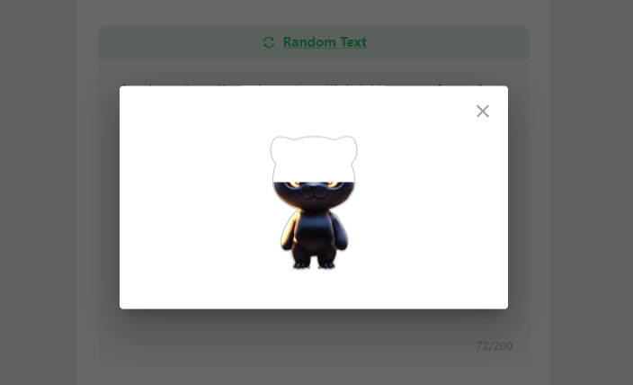

# PrintMon

### 仅父级触发事件

为了实现：当鼠标进入父级标签的时候背景变色，父级和子级之间变化时不变色，从父级出去时变色
可以用事件监听的`currentTarget`

```tsx
        onMouseEnter={(e) => {
          e.currentTarget.style.backgroundColor = 'rgba(0, 255, 0, 0.3)'
        }}
        onMouseLeave={(e) => {
          e.currentTarget.style.backgroundColor = '#d9eee1'
        }}
```


### 局部拖拽文件

需要清除整个页面的拖拽逻辑，只在需要的地方加自定义拖拽


```tsx
const handleDrop = (event) => {
    event.preventDefault();

    const file = event.dataTransfer.files[0];
    const allowedTypes = ['image/jpeg', 'image/png', 'image/webp'];
  
    if (file && allowedTypes.includes(file.type)) {
      setSelectedFile(file);
    } else {
      alert('Invalid file type. Please upload a JPG, PNG, or WEBP image.');
    }
  };

const handleDragOver = (event) => {
    event.preventDefault();
  };


  useEffect(() => {
    const handleWindowDrop = (event) => {
      event.preventDefault();
    };

    window.addEventListener('dragover', handleDragOver);
    window.addEventListener('drop', handleWindowDrop);

    return () => {
      window.removeEventListener('dragover', handleDragOver);
      window.removeEventListener('drop', handleWindowDrop);
    };
  }, []);
```


```tsx
<div 
	onDragOver={handleDragOver}
    onDrop={handleDrop}
>
    ...
</divd>
```


### 后者覆盖前者的逻辑

父级div设置`position: 'relative'`
两个子标签，第一个设置css如下：

```css
position: 'absolute';
width: 100%;
height: 100%;

```


第二子标签设置css如下：

```css
position: 'absolute';
width: 100%;
height: 100%;
left: 0;
```


**基于这个原理，可以实现css虚假加载动画**

在一个父标签下放三个标签，一个是框图，一个是最终图片，一个是白布（设置了背景色为白色）。其中，唯有框图设置`z-index: 1`。由于默认写在后面的元素会盖在前面的元素之上，所以这样可以实现伪加载的动画


**示例代码**


```tsx
          <div
            style={{
              height: '208px',
              width: '384px',
              position: 'relative',
            }}
          >
            
            
            <div
              style={{
                width: '160px',
                height: '160px',
                position: 'absolute',
                top: '15%',
                left: '50%',
                transform: 'translateX(-50%)',
                backgroundColor: 'white',
                animation: 'moveUp 3s forwards',
              }}
            ></div>
          </div>
```

```css
@moveUp{
    from{
    	top: 75%;
    }
    to{
    	top: 0;
    }
}
```





### 路径简写

在根目录下的`tsconfig.json`中添加字段`paths`

```json
{
  "compilerOptions": {
    "paths": {
      "@src/*": ["src/*"],
      "@assets/*": ["src/assets/*"],
    },
}
```


### css加载动画


用一个`div`包裹文字和旋转对象

```tsx
        <div id="loadingWraper">
          <div id="loading"></div>
    
          <p
            style={{
              position: "absolute",
              top: "50%",
              left: "45%",
              padding: "0",
              margin: "0",
              transform: "translate(-50%,-50%)",
              fontSize: "32px",
              fontWeight: "700",
              lineHeight: "32px",
            }}
          >
            16
          </p>
          <span
            style={{
              position: "absolute",
              top: "45%",
              left: "70%",
              padding: "0",
              margin: "0",
              fontSize: "16px",
              fontWeight: "600",
              lineHeight: "24px",
            }}
          >
            %
          </span>
        </div>
```

首先确保`#loadingWraper`和`#loading` 的宽高一致，然后：

```css
#loadingWraper{
  display: flex;
  border-radius: 50%; 
  box-shadow: 0 4px 24px #c0bdbd99; 
}

#loading{
  position: absolute;
  width: 100px;
  height: 100px;
  text-align: center;
  display: inline-block; 
  box-sizing: border-box;
  border-top: 3px solid rgb(160, 217, 158); 
  border-radius: 50%; 
  animation: loading-360 0.8s infinite linear;
}
@keyframes loading-360 {
  0% {
      transform: rotate(0deg); 
  }
  100% {
      transform: rotate(360deg); 
  }
}

```


### tsx子组件

**子组件示例代码**

```tsx

type TextInputProps = {
  text: string
  setText: React.Dispatch<React.SetStateAction<string>>
  vaild?: boolean
  setVaild?: React.Dispatch<React.SetStateAction<boolean>>
}

type TextInputComponentProps = {
  style?: React.CSSProperties
  props: TextInputProps
}

const TextInput: React.FC<TextInputComponentProps> = ({ style, props }) => {
  const handleRandom = () => {
    props.setText('A cute cartoon tiger character with bright orange fur and black stripes.')
    props.setVaild?.(true) 
  }
  ...
}
```


### 常量组

```ts
export enum ETransform {
  position = 'position',
  rotation = 'rotation',
  scale = 'scale',
}
```

使用时只需要调用`ETransform.position`

### mui菜单栏

#### styled

基于特定的标签做多态，外层的样式是`StepButton`本身的样式，`&.Mui-selected`表示被选中时的样式，`& > span`表示组件下的直接子`span`元素的样式

```tsx
const StepButton = styled(ToggleButton)(({ theme }) => ({
  display: 'flex',
  flexDirection: 'column',
  justifyContent: 'center',
  alignItems: 'center',
  width: '64px',
  height: '100px',
  gap: '5px',
  backgroundColor: '#F7F7F7',
  '&.Mui-selected': {
    backgroundColor: '#ffffff',
  },
  '& > span': {
    textTransform: 'none', 
  },
}))
```


#### ToggleButtonGroup

`exclusive`表示只能有一个按钮被选中，`value`是选择不同的按钮所代表的变量，每次选择按钮就会触发`onChange`

```tsx
  const onStepChange = (event: React.MouseEvent<HTMLElement> | null, value: EditorStep) => {
    if (value !== null && value !== undefined ) setStep(value) //防止点击同一个按钮导致bug
  }

<ToggleButtonGroup orientation="vertical" exclusive value={step} onChange={onStepChange}>
        <StepButton value={EditorStep.EYES} key="one">
          <StepEyes /> //这是一个Icon
          <span>Eyes</span>
        </StepButton>
        <StepButton value={EditorStep.COLOR} key="two">
          <StepColor /> //这是一个Icon
          <span>Color</span>
        </StepButton>
        <StepButton value={EditorStep.BASE} key="three">
          <StepBase /> //这是一个Icon
          <span>Base</span>
        </StepButton>
</ToggleButtonGroup>
```


### mui实现跟随式浮框

#### Popover

只要`addAnchorEl`改变，`addPopoveOpen`就会自动跟着改变

```tsx
  const [addAnchorEl, setAddAnchorEl] = useState<SVGSVGElement | null>(null)
  const addPopoverOpen = Boolean(addAnchorEl)
```

利用`ref`设置跟随标签

```tsx
<AddColor
    ref={addBtnRef}
    onClick={() => setAddAnchorEl(addBtnRef.current)}
/>
```

`anchorEl`控制跟随对象，`anchorOrigin`控制跟随方式
`onClose`在点击`Popover`外面的区域时会被触发

```tsx
<Popover
  open={addPopoverOpen}
  anchorEl={addAnchorEl}
  onClose={() => setAddAnchorEl(null)}
  anchorOrigin={{
  vertical: 'bottom',
  horizontal: 'left',
  }}
>
 ...
</Popover>
```


### 滑动框

拓展`styled`以传入参数
下面的`overallScale`是一个存在`store`里面的全局变量
**Tips：必须注意WebkitAppearance这种驼峰的格式，如果不用驼峰命名法，就会报错**

```tsx
interface InputSliderProps extends React.InputHTMLAttributes<HTMLInputElement> {
  overallScale: number
}


const InputSlider = styled('input')<InputSliderProps>(({ theme, overallScale }) => ({
  appearance: 'none',
  width: 296,
  height: 32,
  borderRadius: 3,
  background: `linear-gradient(to right, #00AE42 0%, #00AE42 ${overallScale}%, #f2f2f2 ${overallScale}%, #f2f2f2 100%)`,
  outline: 'none',
  cursor: 'pointer',
  '&::-webkit-slider-thumb': {
    WebkitAppearance: 'none',
    width: 16,
    height: 32,
    border: overallScale === 0 ? '3px solid #f2f2f2' : '2px solid #00AE42',
    background: '#fff',
    cursor: 'pointer',
    borderRadius: 3,
  },
  '&::-moz-range-thumb': {
    width: 16,
    height: 32,
    border: overallScale === 0 ? '3px solid #f2f2f2' : '2px solid #00AE42',
    background: '#fff',
    cursor: 'pointer',
    borderRadius: 3,
  },
  '&::-ms-thumb': {
    width: 16,
    height: 32,
    border: overallScale === 0 ? '3px solid #f2f2f2' : '2px solid #00AE42',
    background: '#fff',
    cursor: 'pointer',
    borderRadius: 3,
  },
}))


<InputSlider
        type="range"
        min="0"
        max="100"
        value={String(overallScale)}
        onChange={(e) => setOverallScale(parseFloat(e.target.value))}
        overallScale={overallScale}
/>
```

拖动的值大于零时，给滑块加上绿色边框，使其看起来被完全包裹在绿色的进度条中，拖动的值等于零时，边框改为灰色


### 将组件当做参数传递

#### 传参处

```tsx
 {[<ScaleX />, <ScaleY />, <ScaleZ />].map((item, ind) => (
          <InputItem key={ind} svgChild={item} />
        ))}
```


#### 接收参数处

```tsx
import { styled } from '@mui/material/styles'
import React from 'react'
interface InputItemProps {
  svgChild: React.ReactNode
}


const SvgWrapper = styled('div')(({ theme }) => ({
  width: 20,
  height: 20,
  display: 'inline-flex',
  justifyContent: 'center',
  alignItems: 'center',
}))

const InputItem: React.FC<InputItemProps> = ({ svgChild }) => {
  return (
      <SvgWrapper>{svgChild}</SvgWrapper>
  )
}

export default InputItem

```


### 弹窗Dialog

`Dialog`标签会出现在和`id=root`的`div`同一级，大小铺满整个屏幕。自动创建一个paper来装载内容，这个paper自动处于屏幕中央，可以用`PaperProps`来修改这个paper的样式。这个paper默认为`relative、flex-column`。如果希望大小自适应，就把paper的宽高写死，然后把里面的希望自适应的标签写成min、maxHeight和flex:1。  下面是一个演示组件


为title设置一个高度确保把后面的元素顶下去，IconButton的color是点击时的颜色

```tsx
import { Dialog, DialogTitle, IconButton, styled } from '@mui/material'
import { Close } from '@src/assets/icons/Close'
import { usePromptStore } from '@src/stores/promptStore'
import { t } from 'i18next'
import React from 'react'

const CenterP = styled('p')(({ theme }) => ({
  display: 'flex',
  justifyContent: 'center',
  alignItems: 'center',
  padding: '0 40px',
  margin: 0,
  fontSize: '16px',
  fontWeight: 700,
  lineHeight: '24px',
}))

type RedemptionProps = {
  style?: React.CSSProperties
}

const Redemption: React.FC<RedemptionProps> = ({ style }) => {
  const { redemptionOpen, setRedemptionOpen } = usePromptStore()
  return (
    <Dialog
      open={redemptionOpen}
      sx={{
        backgroundColor: 'rgb(94, 94, 94, 0.3)',
      }}
      PaperProps={{
        style: {
          width: '480px',
          height: '456px',
          boxSizing: 'border-box',
          borderRadius: '16px',
        },
      }}
    >
      <DialogTitle
        style={{
          position: 'relative',
          height: '36px',
          padding: '0',
        }}
      >
        <IconButton
          aria-label="close"
          sx={{
            color: (theme) => theme.palette.grey[500],
            position: 'absolute',
            right: '8px',
            '&:hover': {
              backgroundColor: 'transparent',
            },
          }}
          onClick={() => {
            setRedemptionOpen(false)
          }}
        >
          <Close />
        </IconButton>
      </DialogTitle>
      <CenterP>{t('prompt:redemption_title')}</CenterP>
    </Dialog>
  )
}

export default Redemption

```


### 复制板

对p标签设置ref ` const textRef = useRef<HTMLParagraphElement>(null)`

利用JavaScript提供的API做复制函数

```tsx
  const handleCopy = () => {
    if (textRef.current) {
      const textToCopy = textRef.current.innerText
      navigator.clipboard
        .writeText(textToCopy)
        .then(() => {
          setOpen(true)
        })
        .catch((err) => {
          console.error('Failed to copy text: ', err)
        })
    }
  }
```


利用mui的`Snackbar`做复制成功的提示

```tsx
  const handleSnackbarClose = (event?: React.SyntheticEvent | Event, reason?: string) => {
    if (reason === 'clickaway') {
      return
    }
    setOpen(false)
  }      
	<Snackbar
        open={open}
        autoHideDuration={1500}
        onClose={handleSnackbarClose}
        message="Text copied to clipboard"
    />
```


### 循环播放视频

视频在弹窗窗口中，ref在弹窗出来之前没被挂上，所以一个useEffect不够，需要多一个useEffect监听弹出的出现

```tsx
  const videoRef = useRef<HTMLVideoElement>(null)
  const [currentVideoIndex, setCurrentVideoIndex] = useState<number>(-1)
  useEffect(() => {
    if (downLoadingOpen) {
      setCurrentVideoIndex(0)
    }
  }, [downLoadingOpen])
  useEffect(() => {
    const videoElement = videoRef.current
    const handleVideoEnded = () => {
      setCurrentVideoIndex((prevIndex) => (prevIndex + 1) % downloadingViedo.length)
    }

    if (videoElement) {
      videoElement.addEventListener('ended', handleVideoEnded)
      videoElement.load()
      videoElement.muted = true
      videoElement.play()
    }

    return () => {
      if (videoElement) {
        videoElement.removeEventListener('ended', handleVideoEnded)
      }
    }
  }, [currentVideoIndex])

        <video ref={videoRef} width="640" height="480" controls autoPlay muted>
          <source src={downloadingViedo[currentVideoIndex]} type="video/mp4" />
          Your browser does not support the video tag.
        </video>
```


### flex排版

父标签为`flex`，两个子标签，第一个`flex:1`第二个`display: flex, justifyContent: 'flex-end'`可以实现第二个子标签处于父标签的最底层，如果第一个子标签是可以`scroll`的，那么还需要为其加上`minHeight:0`


### 相对位移范围

由于3D的位置是调中心点的`position`，真正的X范围应该是底座最小X和最大X分别减去模型最低点的X得到偏差，然后转移到中心点position，也就是要加上触发位置改变之前的模型的position的x

在求范围时，为了防止边缘旋转移飞出去，需要加上Infinity的判断

```ts
export function findRangeBounds(
  convexHull: THREE.Mesh,
  baseConvexHull: THREE.Vector3[],
  surfaceZ: number,
  offsetX: number,
  offsetY: number
): [minX: number, maxX: number, minY: number, maxY: number, minZ: number, maxZ: number] {
  const lowestPoint = findMinZPoint(convexHull)
  const surfaceBounds = findUpperSurfaceBounds(baseConvexHull, lowestPoint)
  const minX = parseFloat((surfaceBounds.minX + offsetX).toFixed(1))
  const maxX = parseFloat((surfaceBounds.maxX + offsetX).toFixed(1))
  const minY = parseFloat((surfaceBounds.minY + offsetY).toFixed(1))
  const maxY = parseFloat((surfaceBounds.maxY + offsetY).toFixed(1))
  const maxZ = parseFloat(surfaceZ.toFixed(1)) - 0.1
  return [minX, maxX, minY, maxY, 0, maxZ]
}


export function findUpperSurfaceBounds(
  baseConvexHull: THREE.Vector3[],
  lowestPoint: THREE.Vector3
): {
  minX: number
  maxX: number
  minY: number
  maxY: number
} {
  let minX = Infinity
  let maxX = -Infinity
  let minY = Infinity
  let maxY = -Infinity

  const pX = lowestPoint.x
  const pY = lowestPoint.y
  for (let i = 0; i < baseConvexHull.length; i++) {
    const p1 = baseConvexHull[i]
    const p2 = baseConvexHull[(i + 1) % baseConvexHull.length]
    if ((pX >= p2.x && pX <= p1.x) || (pX >= p1.x && pX <= p2.x)) {
      const slope1 = (p2.y - p1.y) / (p2.x - p1.x)
      const y = p2.y + (pX - p2.x) * slope1
      if (y < minY) {
        minY = y
      }
      if (y > maxY) {
        maxY = y
      }
    }
    if ((pY >= p2.y && pY <= p1.y) || (pY >= p1.y && pY <= p2.y)) {
      const slope2 = (p2.x - p1.x) / (p2.y - p1.y)
      const x = p2.x + (pY - p2.y) * slope2
      if (x < minX) {
        minX = x
      }
      if (x > maxX) {
        maxX = x
      }
    }
  }
  if (minX === Infinity) {
    minX = lowestPoint.x
  } else {
    minX -= lowestPoint.x
  }
  if (maxX === -Infinity) {
    maxX = lowestPoint.x
  } else {
    maxX -= lowestPoint.x
  }
  if (minY === Infinity) {
    minY = lowestPoint.y
  } else {
    minY -= lowestPoint.y
  }
  if (maxY === -Infinity) {
    maxY = lowestPoint.y
  } else {
    maxY -= lowestPoint.y
  }
  return { minX, maxX, minY, maxY }
}
```


### 传参式Class

通过参数决定属性，以此构造通用型Class


### 显示照片

对于img标签，如果设置样式

```tsx
        style={{
          position: 'absolute',
          width: '100%',
          height: '100%',
          objectFit: 'contain',
        }}
```

那么图片会原样显示，但是img标签内部可能会留有白边，如果是`objectFit:'cover'`那么会缩放图片使其布满img


### useEffect异步

```tsx
  useEffect(() => {
    const fetchData = async () => {
      if (currentStage === EPrintMonStage.RodinProgress) {
        await handleGenerate()
      }
    }
    fetchData()
  }, [])
```


### 大小自适应

为了防止写死的大小在不同尺寸的平面上表现有问题，可以用`flex:1`

### 显示和实际存值不同的输入框

将缩放比例映射到实际大小，显示的值乘以缩放比例，所以改值的时候也需要除以缩放比例

```tsx
        onChange={(e) => {
          setValue(String(parseFloat(e.target.value) / scaleFactor))
        }}
        value={String(Math.round(parseFloat(value) * scaleFactor * 10) / 10)}
```


### 代替alert的提示


```tsx
	  import { useSnackbar } from 'notistack'
	 //横纵在中间，纵轴在顶部，显示两秒的警示
      enqueueSnackbar('File size is too large. Please upload a file less than 10MB.', {
        variant: 'error',
        anchorOrigin: { horizontal: 'center', vertical: 'top' },
        autoHideDuration: 2000,
      })
```

### a标签

**点击不跳转**

`       href="javascript:void(0);"`

**点击自动下载**

```html
            <a
              href={userPickImageUrl}
              download={'printMonSDImage.png'}
            >
```


### 解决padding导致的位移

`boxSizing: border-box`

