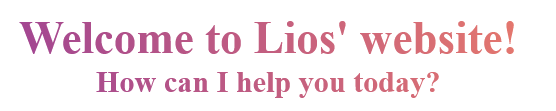
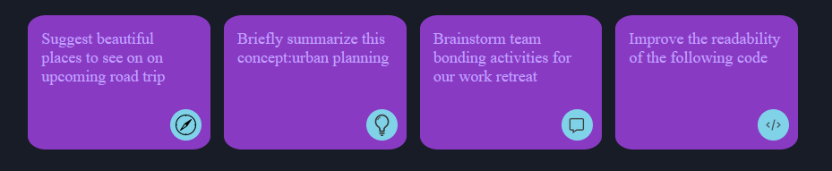
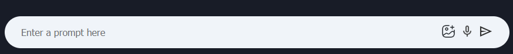

# Vite项目：Gemini Clone

### 资源统一导出

assets.js于各资源放在同一路径下（src/assets）

```js
//assets.js
import history_icon from './history_icon.png'
import menu_icon from './menu_icon.png'
import plus_icon from './plus_icon.png'
import question_icon from './question_icon.png'
import setting_icon from './setting_icon.png'
import bulb_icon from './bulb_icon.png'
import compass_icon from './compass_icon.png'
import gallery_icon from './gallery_icon.png'
import mic_icon from './mic_icon.png'
import user_icon from './user_icon.png'
import youtube_icon from './youtube_icon.png'
import message_icon from './message_icon.png'
import code_icon from './code_icon.png'
import send_icon from './send_icon.png'
import gemini_icon from './gemini_icon.png'

export const assets = {
    history_icon,
    menu_icon,
    plus_icon,
    question_icon,
    setting_icon,
    bulb_icon,
    compass_icon,
    gallery_icon,
    mic_icon,
    user_icon,
    youtube_icon,
    message_icon,
    code_icon,
    send_icon,
    gemini_icon
}
```

导入这些资源只需要`import {assets} `然后在img标签中用对应的变量替换src的内容`src={assets.menu_icon}`

### flex

`flex`和`inline-flex`都是弹性模型，前者是块级，会占据父级的所有宽度，后者是内联，按照内容进行宽度排列
`min-height: 100vh`设置最小高度为视窗的百分百
`flex-direction: column`设置主轴为纵轴，也就是元素纵向排列
`justify-content: space-center`设置在主轴上居中对齐
`justify-content: space-between`设置第一个元素在头，最后一个元素在尾，中间均匀分布
`align-items: center`表示子元素在侧轴上居中对齐
`align-items: start`表示子元素在侧轴起点开始排列
`gap:10px`子元素之间的间距为10px
`flex:1`父级容器是flex时，子容器如果有`flex:1` 那么它的大小可以自适应

下面的代码让子元素排成一行（竖直方向居中）

```css
    display: flex;
    align-items: center;
    justify-content: space-between;
```

下面的代码使得div中的文字处于div的正中间

```html
<div className="submit">Sign Up</div>
```

```css
.submit{
    display: flex;
    justify-content: center;
    align-items: center;
}
```

### 文字样式设计

下面的代码中`-webkit`前缀表示对旧版浏览器也有效

```css
    text-align: center;  /*文字居中*/
    background: -webkit-linear-gradient(16deg, #8631a1, #ff8b5f); /*设置线性渐变背景色*/
    -webkit-background-clip: text;  /*设置背景色只对文本有效*/
    -webkit-text-fill-color: transparent;  /*元素本身的填充色，也就是除去文本之外的部分为透明*/
```



### Grid布局

父级标签设置为`display:grid`时表示其子元素将以网格的形式排列
`repeat(auto-fill, minmax(180px, 1fr))`表示每一列都是自动均匀填充，最小宽度为180px

下面是一个示例，父级标签cards为`grid` 有四个子标签card

```css
    display: grid;
    grid-template-columns: repeat(auto-fill,minmax(180px,1fr));
    gap: 15px;
    padding: 20px;
```




### input框样式设计

```html
<div className="search-box">
   <input type="text" placeholder='Enter a prompt here'/>
   <div>
       
       
       
   </div>
</div>
```

```css
.search-box img{
    width: 24px;
    margin-right: 8px;
    cursor: pointer;
}
.search-box input{
    flex: 1;  /*自动用input框填充除掉图片之外，父标签剩下的区域*/
    background: transparent;  /*input框的背景色设置为透明*/
    border: none;  /*没有边框*/
    outline: none;  /*去掉点击时显示的框*/
    padding: 8px;
    font-size: 16px;
}
```



### 共享context

##### 创建并共享context

`main.jsx`中渲染时把整个App的内容都套在了`ContextProvider`中，`context`可以被App组件及其所有的子组件共享

```jsx
//main.jsx
import React from 'react'
import ReactDOM from 'react-dom/client'
import App from './App.jsx'
import './index.css'
import ContextProvider from "./context/Context.jsx";

ReactDOM.createRoot(document.getElementById('root')).render(
  <ContextProvider>
    <App />
  </ContextProvider>,
)
```

##### 使用context

设置`input`框的输入事件和发送按钮对应图片的点击事件

```jsx
<input  onChange={(e) => setInput(e.target.value)} value={input} type="text" placeholder='Enter a prompt here'/>
//改值的时候就修改input   输入框内的值始终等于input
```

```jsx
 onSent()} src={assets.send_icon} alt=""/>
//点击图片就触发消息发送函数
```

### 自定义动画

```css
@keyframes loader {
    0%{
        background-position: -800px 0; /*左移800px*/
    }
    100%{
        background-position: 800px 0;  /*右移800px*/
    }
}
```

使用渐变动画

```css
.loader hr{
    border-radius: 4px;
    border: none;
    background: linear-gradient(to right, #ea26c9, #aea7f8, #ea26c9);  /*颜色从左渐变到右*/
    background-size: 800px 50px;
    height: 20px;
    animation: loader 3s infinite linear;  /*动画每三秒播放一轮，无限循环*/
}
```

### 消去滑动框

```css
.result{
	scrollbar-width: none; /* For Firefox */
    -ms-overflow-style: none; /* For IE and Edge */
}

	.result::-webkit-scrollbar{
    display: none;  /*others*/
}
```

### 字符串选值替换

```jsx
//这里的response是一个字符串，**与**之间的内容原本应该被渲染成粗体，而*后面的内容应该是独成一行的
        let responseArray = response.split("**");
        let newResponse = "";
        for(let i = 0;i < responseArray.length; i++){
            if ( i%2 ==1) {
                newResponse += "<b>" + responseArray[i] + "</b>"

            }
            else{
                newResponse += responseArray[i];
            }
        }
        newResponse = newResponse.split("*").join("<br/>");
```

### 字符串以打字的形式输出

```jsx
    //每75毫秒显示一个字
	const [resultData,setResultData] = useState("") 
	const delayPara = (index,nextWord) => {
            setTimeout(function (){
                setResultData(prev=>prev+nextWord);  //set函数可以接收当下值为参数
            },75*index)
    }
    let newResponseArray = newResponse.split(" ");
    for(let i= 0;i < newResponseArray.length; i++){
       const nextWord = newResponseArray[i];
       delayPara(i,nextWord+" ");
    }
```

### 淡入动画

@keyframes是全局可用的，一个css中定义了，其它css也可以用

```css
@keyframes fadeIn{
    0%{
      opacity: 0;
    }
  100%{
    opacity: 1;
  }
}
#root{
	  animation: fadeIn 1.5s;
}
```

### 鼠标样式

```css
html{
  cursor: url("./assets/cursor.png"),auto;
}
```

### 针对不同媒体查询条件设计样式

当设备最大宽度小于等于600px就不显示sidebar

```css
@media (max-width: 600px){
    .sidebar{
        display: none;
    }
}
```

### 根据内容是否为空决定是否出现提交图案

```css
  {input ?  onSent()} src={assets.send_icon} alt=""/> : null}
```

### Effect确保异步函数的完成

想要让一个div被点击的时候先触发`setInput`修改`input`然后触发`onSent` ，由于`setInput`是异步的，所以需要用Effect

```jsx
    useEffect(() => {
        if (input !== '') {
            onSent();
        }
    }, [input]);
    <div onClick={() => {
          setInput("Suggest beautiful places to see on on upcoming road trip");
              }} className="card">
          <p>Suggest beautiful places to see on on upcoming road trip</p>
          
    </div>
```

### Map渲染Error解决方案

为map返回的对象加上独属的`key`

```jsx
     {prevPrompts.map((item,index)=>{
         return (
              <div key={index} onClick={() => loadPrompt(item)} className="recent-entry">
              	
              	<p>{item.slice(0,18)}...</p>
              </div>
          )
	})}
```

### Github静态网页

##### github创建仓库

仓库名：`geminiClone`

##### 本地连接仓库

项目文件夹终端输入指令

```shell
git init
git remote add origin https://github.com/universyu/geminiClone.git
git branch -M main
```

##### 添加依赖

终端运行`npm install gh-pages --save-dev`

`package.json`中向`scripts`添加`"deploy": "gh-pages -d dist",`

##### 添加CNAME

添加CNAME（gemini.countingstars.cc）至public文件夹

##### 上传至仓库

在终端执行命令

```shell
npm run build
npm run deploy
git push -u origin main
```

##### Cloudflare设置

域管理中添加记录：类型`CNAME` 名称`gemini`  内容`universyu.github.io`

##### github页面设置

`Source`设置为`Deploy from a branch`
`Branch`设置为`gh-pages` 
