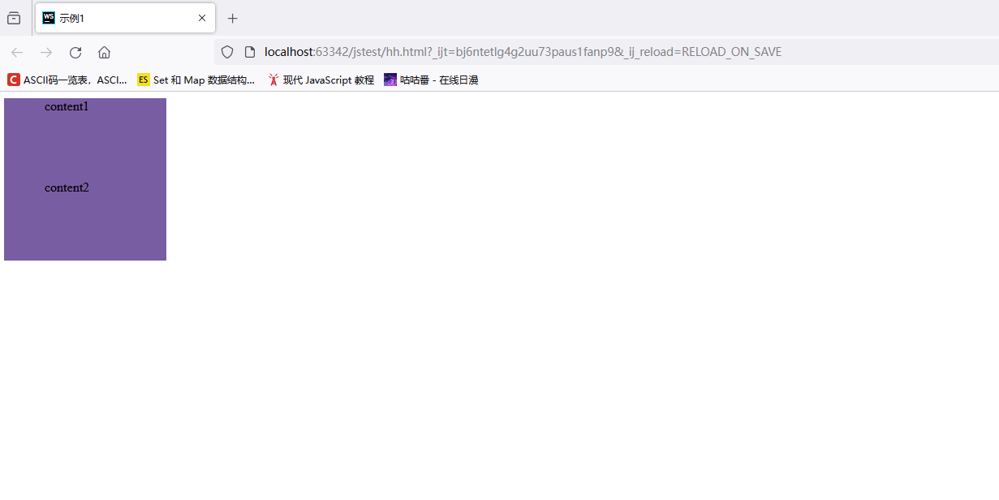
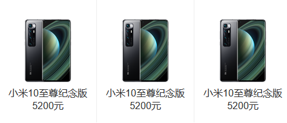
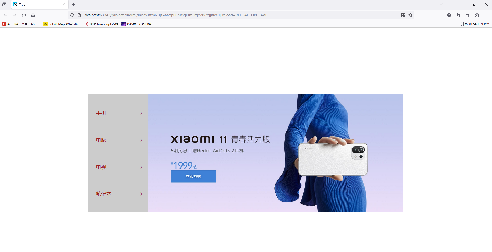
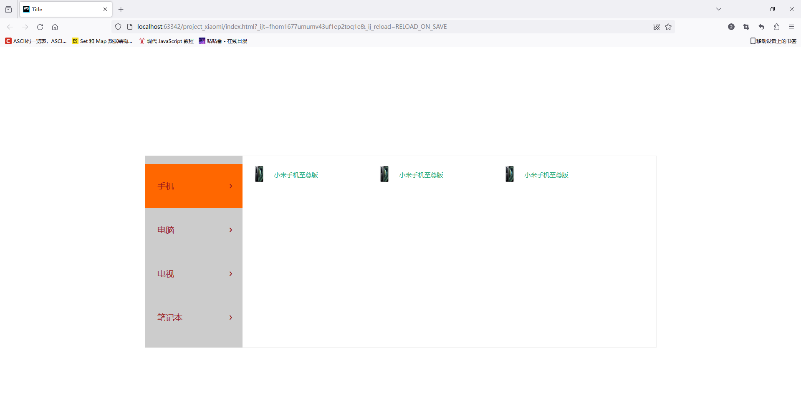
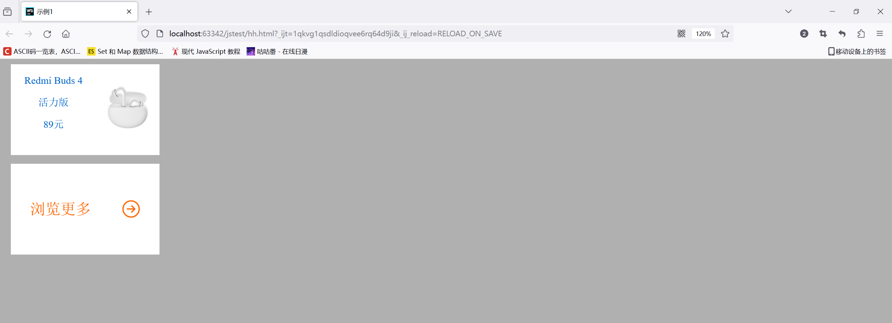
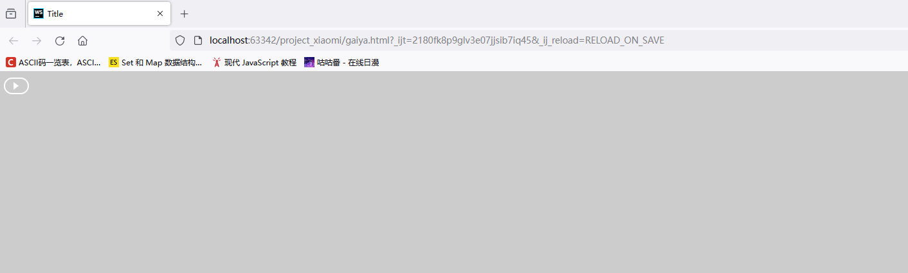

# html、css项目--小米商城

## 图片居中``

设置图片的高度和所处的父级对象的高度一致，将父级的位置设为relative，图片位置设为absolute则表示图片以父级为参考点做定位，left表示整张图片从距离左边一半的位置开始展示，再用transform把图片向左移动半张图片（transform和top的区别在于transform只是视觉上的移动，不会更改周围元素的位置，而top会影响到周围）

```css
.header{
    width: 100%;
    height: 120px;
    overflow: hidden;
    position: relative;
}
.header img{
    height: 120px;
    position: absolute;
    left: 50%;
    transform:translateX(-50%);
}
```

## 块居中

已知块的宽度，可以用left: 50%让其左边框处于父级容器的中间，再用margin-left移动左边框，移动距离就是块的宽度的一半，这样块就居中于其父容器中

```css
.download{
    width: 124px;
    height: 148px;
    background: #fff;
    position: absolute;
    left: 50%;	 /*需要父级容器position:relative且块position:absolute*/
    margin-left: -62px;  /*负号表示左移*/
    overflow: hidden;
} 
```

## 在容器内完成子元素的居中



```html
<div class="item">
    <p>content1</p>
    <p>content2</p>
</div>
```

```css
.item{
    width: 200px;
    height: 200px;
    background: #795da3;
}

p{
    width: 100px;
    height: 100px;
    margin: 0 auto;  /*上下外边距为0  水平自动居中*/
}
```

## 设计滑动动画

鼠标悬停时触发滑动动画改变图片

```html
<div class="logo">
    
    
</div>
```

```css
        .logo{
            width: 55px;
            height: 55px;
            background: #ff6700;
            float: left;
            margin-top: 23px;
            position: relative;
            border-radius: 15px;
            overflow: hidden;
        }

        .logo img{
            width: 100%;
            height: 100%;
            position: absolute;
            top: 0;
            transition: all 0.2s;  /*执行动画*/
        }

        .mi-home{
            left: -55px;
        }

        .mi-logo{
            left:0;
        }

        .logo:hover .mi-home{
            left: 0;
        }

        .logo:hover .mi-logo{
            left: 55px;
        }
```


## 设计鼠标悬停才显示的箭头

```css
.arrow{
    width: 0;
    height: 0;
    border-bottom: 8px solid #fff;  /*底边框是白色三角形*/
    border-left: 8px solid transparent;  /*左框不显示，只占位*/
    border-right: 8px solid transparent;  /*右框不显示，只占位*/
    position: absolute;
    bottom: 0;  /*底部和父级容器的底部重合*/
    left: 50%;
    margin-left: -8px;
    display: none;
}

.black-nav-left li:hover .arrow{
    display: block;
} /*arrow类的父级类是black-nav-left  而且arrow类写在li里面，只要鼠标悬停在black-nav-left下面的li，就会让li里面的.arrow显示*/
```

## 设置列表横向

直接设置li标签的float为left即可

## 设置图像转变过渡时间

设置transition之后再设置一个hover会实现动画效果

```css
.item{
    transition: all 0.2s linear; /*鼠标悬停时所有属性都会应用0.2s的过渡动画转变，linear表示动画呈线性变化*/
}
.item:hover{
    transform: translateY(-2px);
    box-shadow: 0 15px 30px rgba(0,0,0,0.1); /*阴影水平偏移0，向下偏移15px，模糊半径为30，颜色为rgba(0,0,0) 透明度0.1*/
}
```

## 边框优化

```css
.search input{
    width: 244px;
    height: 40px;
    float: left;
    border: 1px solid #e0e0e0;  
    box-sizing: border-box;  /*总宽度244和总高度40包括了边界线，也就是防止边界线的加入导致块的大小改变*/
    outline: none;		/*选中input框时，默认显示提示边框表示已选中，让outline为none就不会有提示边框*/
}
```

## 间隔竖线

隔开纯文字可以直接用span标签（span标签不会另起一行，直接在文字后面加span那么这个竖线就紧贴在文字后面）写一个竖线，然后设置span的margin

```css
margin: 0 4px; /*上下边距为0，左右边距为4px*/
```

隔开复杂内容，比如图片加文字



把文字和图片都放在li标签下，隔开三个li标签即可，利用border隔开

```css
border-right: 1px solid #eee;  /*右边界为1px 颜色为灰色*/
```

## 设置层级

z-index可以设置position为 `relative`、`absolute` 或 `fixed` 的元素的层级，高层级的显示在上面

```css
z-index:10;
```

## 悬停展示列表





```html
<div class="wrap">   <!--包裹整块内容的容器-->
    	<!--广告照片和左边的列表是同级别的两个块-->
    <div class="slide">   
        <ul>
            <li>
                <a href="#">手机<i class="iconfont">&#xe621</i></a> <!--“手机”和它对应的悬浮出来的内容是同级别的两个块-->
                <div class="slide-list">
                    <ul>
                        <li>
                            <a href="#">
                                
                                <span>小米手机至尊版</span>  <!--需要放在同一行时用span标签-->
                            </a>
                        </li>
                        <li>
                            <a href="#">
                                
                                <span>小米手机至尊版</span>
                            </a>
                        </li>
                        <li>
                            <a href="#">
                                
                                <span>小米手机至尊版</span>
                            </a>
                        </li>
                    </ul>
                </div>
            </li>
            <li><a href="#">电脑<i class="iconfont">&#xe621</i></a></li>
            <li><a href="#">电视<i class="iconfont">&#xe621</i></a></li>
            <li><a href="#">笔记本<i class="iconfont">&#xe621</i></a></li>

        </ul>
    </div>
</div>
```

```css
.wrap{   /*整块内容的风格设计*/
    width: 1226px;
    margin: 0 auto;  /*上下外边距0  左右外边距自动实现居中*/
    top: 260px;		/*向下移动一定距离实现垂直居中*/
    position: relative;  /*top等一系列移动位置的参考点为自身原本的位置*/
}

.banner-img{
    width: 100%;  /*先铺满wrap，然后让slide用定位的方式覆盖到wrap左边*/
}

.slide{
    width: 234px;
    height: 420px;
    padding: 20px 0;  /*上下内边距20px（分别从文字顶部和底部向上和向下增加20px的高度） 左右内边距0*/
    background: #cccccc;
    position: absolute;  /*top等一系列移动位置的参考点为父级第一个position:relative对象的位置*/
    left: 0;
    top: 0;
}

.slide li{
    height: 105px;
    line-height: 105px;  /*行高设置为高，实现垂直方向的居中*/
    text-align: left;    /*文字靠左*/
    padding-left: 30px;  /*不完全靠左，留下30px*/
    font-size: 20px;
}

.slide li a{
    color: #9a1d1d;  
}

.slide i{
    float: right;  /*浮动到右边*/
    padding-right: 20px;  
}

.slide>ul>li:hover {  /*如果用空格则表示向下的所有ul  >表示向下找的第一层对应的ul*/
    background: #ff6700;
}

.slide-list{
    width: 992px;
    height: 460px;
    background: #fff;
    border: 1px solid #eee;
    border-left: none;
    box-sizing: border-box;
    position: absolute;
    top: 0;
    left: 234px;
    display: none;
}

.slide li:hover .slide-list{
    display: block;
}

.slide-list li{
    width: 300px;
    height: 76px;
    float: left;
    padding: 18px 0 18px 20px;
    box-sizing: border-box;
    line-height: 76px;
}

.slide-list img{
    width: 40px;
    height: 40px;
    margin-right: 10px;
}

.slide-list span{
    font-size: 15px;
    color: #20a879;
    position: relative;
    top: -12px;
}
```

## 悬浮修改不透明度

opacity可以设置不透明度，先设置为一个小于1的值，然后设置悬浮状态小opacity为1即可

## margin结合display

设置margin-bottom之后无法有效将元素之间撑开是因为display默认为inline值，这个状态下元素无法影响其他元素的布局，所以需要把display改成block，块级元素独成一行，可以把其他元素推开

## 文字与图片共处于同一块



```html
<div class="item">  <!--一个大块中有上下两个小块-->
    <div>  <!--每个小块都是一个a标签，这个小块包含了图片和文字-->
        <a href="#">
            
            <p>Redmi Buds 4</p>
            <p>活力版</p>
            <p>89元</p>
        </a>
    </div>
    
    <div>
        <a href="#">
            浏览更多
            <i class="iconfont">&#xe619</i>
        </a>
    </div>
</div>
```

```css
.item{  /*设置整个块在页面中靠左，且不是紧贴左边界，而是留下14px的间隙*/
    width: 234px;
    height: 300px;
    float: left;
    margin-left: 14px;
}
.item div{  /*设置两个小块总高度286px 留下14px做两者的间隔*/
    width: 234px;
    height: 143px;
    background: #fff;
}
.item>div:nth-child(1){  /*找到item下的div，且div满足条件“是父级的第一个子标签”*/
    margin-bottom: 14px;  /*第一个小块和第二个小块之间有14px的间隔*/
    text-align: center;  /*文字水平居中*/
}
.item img{
    width: 100px;
    height: 100px;
    position: relative;
    top: 18px;  /*按照实际微调位置*/
    float: right;  /*让第一小块的图片漂浮至右边，形成左文字右图片的形式*/
}
.item>div:nth-child(2) a{
    font-size: 24px;
    color: #ff6700;
    height: 143px;
    line-height: 143px;
    /*使第二小块的文字靠左但又不紧贴着左边*/
    text-align: left;
    margin-left: 30px;
}
.item>div:nth-child(2) i{
    float: right;  /*图标靠右，形成左字右图标的形式*/
    font-size: 30px;
    margin-right: 30px;
}
```

## 播放视频的箭头



```html
<div class="btn">
    <div class="sanjiao"></div>
</div>
```

```css
.btn{  /*圆框*/
    width: 32px;
    height: 20px;
    border-radius: 12px;
    border: 2px solid #fff;
}

.sanjiao{  /*向右的三角*/
    width: 0;
    height: 0;
    border-left: 8px solid #fff;
    border-top: 6px solid transparent;
    border-bottom: 6px solid transparent;
    margin: 5px auto;
}
```

