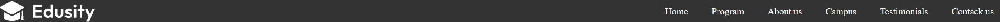
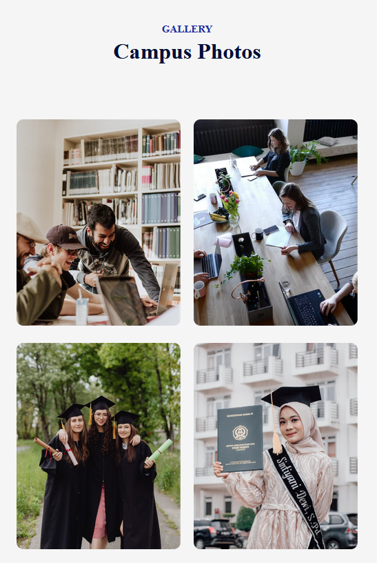

#  全响应式网站（Vite）

### 顶部导航

#### css Reset

```css
/* index.css */
*{
	margin: 0;
    padding: 0;
    box-sizing: border-box;
}
a{
	text-decoration: none;
    color: inherit; /*颜色继承父元素的文字颜色*/
    cursor: pointer; /*悬停时鼠标变为可点击样式*/
}
```

#### 横向导航

设计带有图标和横向列表的导航栏

```jsx
   // Navbar.jsx 
		<nav>
            
            <ul>
                <li>Home</li>
                <li>Program</li>
                <li>About us</li>
                <li>Campus</li>
                <li>Testimonials</li>
                <li>Contack us</li>
            </ul>
        </nav>
```

```css
  /*Navbar.css*/
nav{
    width: 100%;
    background: #333;
    color: white;
   	position: fixed; /*固定位置不随滑动条的滑动而改变，且显示在其它内容之上，不会盖住背景图*/
    padding: 4px 0;
    top: 0;
    left: 0;
    display: flex;
    align-items: center;  
    justify-content: space-between; /*如果没有，那么列表在图片的右边，之间没有很大的空隙*/
    z-index: 10;
}

.logo{
    width: 180px;
}

nav ul li{
    display: inline-block; /*如果没有，那么列表纵向排列*/
    list-style: none;
    margin: 5px 20px;
    font-size: 16px;
}
```



为了让左右不要碰到边界，可以给nav标签加上padding

`<nav className='container'>`

```css
  /* index.css */
.container{
	padding-left: 10%;
    padding-right: 10%;
}
```


#### 设置样式好看的按钮

`<li><button className='btn'>Contack us</button></li>`

```css
/*index.css*/
.btn{
    background: #fff;
    color: #212121; /*文字颜色*/
    padding: 14px 25px; /*文字与button边缘之间的间距，上下14px，左右25px*/
    font-size: 16px;
    border-radius: 30px;
    cursor: pointer;
    border: 0;
}
```

### 背景（hero）

#### 背景图

```html
   <div className='hero'>
    
   </div>
```

对应的css

```css
.hero{
    /*用照片填充整个屏幕，并为照片加上一层颜色做滤镜*/
    width: 100%;
    min-height: 100vh;
    background: linear-gradient(rgba(8,0,58,0.7),rgba(8,0,58,0.7)), url("../../assets/hero.png");
  	/*背景以伸缩的方式自适应页面的伸缩，背景的中间处于屏幕的中间*/
    background-size: cover;
    background-position: center;
    /*字体为白色*/
    color: white;
    /*弹性盒子模型，子元素侧轴、主轴都居中对齐*/
    display: flex;
    align-items: center;
    justify-content: center;
}
```

#### 背景文本

```html
<div className="hero-text">
    <h1>We Ensure better education for a better world</h1>
    <p>Our cutting-edge curriculum is designed to empower students with the knowledge,skills,and experiences needed to excel in the dynamic field of education</p>
    <button className={'btn'}>Explore more  </button>
</div>
```

对应的css

```css
.hero-text{
    text-align: center; /*文字不做居中就默认从左边开头开始排版*/
}
```

对`btn`添加样式设计

```css
.btn{
	display: inline-flex; /*设置为inline-flex的会按照父级flex标签的align-items和justify-content对齐*/
    align-items: center;
    justify-content: center;
}
.btn img{
    width: 28px;
    margin-left: 10px;
}
```

效果是文字、按钮居中且对齐，按钮中的文字和图片也在竖直方向上居中


### flex实现块的整齐排列

结构如下

```html
        <div className={'programs'}>
            <div className="program">
                
                <div className="caption">
                    
                    <p>Graduation Degree</p>
                </div>
            </div>
            <div className="program">
                
                <div className="caption">
                    
                    <p>Masters Degree</p>
                </div>
            </div>
            <div className="program">
                
                <div className="caption">
                    
                    <p>Post Graduation</p>
                </div>
            </div>
        </div>
```

首先实现`programs`中三个`program`的整齐排列（横向排列且在竖直方向上居中对齐）

```css
.programs{
    display: flex;
    align-items: center;
    justify-content: space-between;
}
.program{
    flex-basis: 31%; /*占用flex父标签的31%的空间*/
}
.programs img{
    width: 100%; /*照片占满整个program*/
    border-radius: 10px;
}
```

下面实现`caption`占满整个`program`，且只有悬停才显示

先为`program`加上`position:relative`，然后设计`caption`的css样式

```css
.caption{
    border-radius: 10px;
    /*填充整个program*/
    position: absolute;
    top: 0;
    left: 0;
    bottom: 0;
    right: 0;
    
    background: rgba(0,15,152,0.3);
    /*图片和文字纵向排列，且居中*/
    display: flex;
    align-items: center;
    justify-content: center;
    
    flex-direction: column;
    color: #fff;
    cursor: pointer;
    /*悬停时显示，并让图标和文字从下向上滑*/
    opacity: 0;
    padding-top: 70%;
    transition: 0.4s;
}
.program:hover .caption{
    opacity: 1;
    padding-top: 0;
}
```

### 支持传承的通用型组件

下面代码实现一个可以传参的`Title`组件

```jsx
import React from 'react';
import './Title.css'

const Title = ({subTitle,title}) => {
    return (
        <div className={'title'}>
            <p>{subTitle}</p>
            <h2>{title}</h2>
        </div>
    );
};

export default Title;
```

```css
.title{
    text-align: center;
    color: #212EA0;
    font-size: 15px;
    font-weight: 600;
    text-transform: uppercase;
    margin: 70px 0 30px;
}
.title h2{
    font-size: 32px;
    color: #000f38;
    margin-top: 5px;
    text-transform: none;
}
```

调用方法：`<Title subTitle={'Our PROGRAM'} title={'What We Offer'} />`


### 状态动态变化的组件

只要滑动页面至800px以上就给nav加额外的css属性

```jsx
    const [sticky,setSticky] = useState(false);

   useEffect(() => {
    const handleScroll = () => {
        window.scrollY > 800 ? setSticky(true) : setSticky(false); // 800的单位是px
    };
    window.addEventListener('scroll', handleScroll);
    // 返回的函数会在组件卸载或者依赖数组中的依赖改变时运行
    return () => {
        window.removeEventListener('scroll', handleScroll);
    };
}, []); // 空依赖数组表示这个effect只在组件挂载时运行一次

	return (
        <nav className={`container ${sticky && 'dark-nav'}`}> 
        </nav>
    );
```

### 通用样式的局部修改

在`index.css`中的样式优先级更高，其中设置`.btn`的`background:#fff` 为了只修改背景色，依旧继承`index.css`中设置的`.btn`的其它样式，为对应的标签写上`btn`和`dark-btn` 

```css
.btn.dark-btn{
    background: #212EA0;
}
```

### 可滑动组件

**整体结构**：`testimonials`下有两个`img`标签显示左右滑动的按钮，还有一个`slider`，其中有一个`ul`标签，`ul`标签下有四个`li`标签，每个`li`标签的结构是`slide`下有`user-info`和`p`标签（学生评价），而`user-info`中有`img`标签和一个`div`，在这个`div`中有`h3`标签（学生姓名）和`span`标签（学生家乡）

```html
		<div className={'testimonials'}>
            
            
            <div className={'slider'}>
                <ul ref={slider}>
                    <li>
                        <div className="slide">
                            <div className="user-info">
                                
                                <div>
                                    <h3>...</h3>
                                    <span>...</span>
                                </div>
                            </div>
                            <p>...</p>
                        </div>
                    </li>
                    ...
                </ul>
            </div>
        </div>
```

**对应的css样式**

```css
.testimonials{
    margin: 80px auto;
    padding: 0 80px;
    position: relative;
}
.next-btn, .back-btn{
    position: absolute;
    top: 50%;
    right: 0;
    transform: translateY(-50%);
    padding: 15px;
    width: 50px;
    border-radius: 50%;
    cursor: pointer;
    background: #212EA0;
}
.back-btn{
    right: auto;
    left: 0;
}
.slider{
    overflow: hidden;
}
.slider ul{
    display: flex;
    width: 200%; /*内容展开成父级容器的两倍宽度，多出来的100%被隐藏*/
    overflow-x: hidden;
}
.slider ul li{
    list-style: none;
    width: 50%;
    padding: 20px;
}
.slide{
    height: 100%;
    box-shadow: 0  0 20px rgba(0,0,0,0.1);
    padding: 40px;
    border: 10px;
    color: #676767;
    line-height: 1.4;
}
.user-info{
    display: flex;
    align-items: center;
    margin-bottom: 20px;
    font-size: 15px;
}
.user-info h3{
    color: #212EA0;
}
.slide img{
    width: 65px;
    border-radius: 50%;
    border: 4px solid #212EA0;
}
```

**添加可滑动逻辑**

添加变化时间

```css
.slider ul{
    transition: 0.5s;
}
```

添加核心逻辑处理代码

```jsx
const slider = useRef();
let tx = 0;

const slideForward = () => {
    if(tx>-50){
        tx -= 25;
    }
    slider.current.style.transform = `translateX(${tx}%)`; //translateX的百分比是对于自己的百分比
}
const slideBackward = () => {
    if(tx<0){
        tx += 25;
    }
    slider.current.style.transform = `translateX(${tx}%)`;
}
```

添加点击监视

``
``

添加`ref`
`<ul ref={slider}>`

### 联系组件

样式设计

```html
        <div className="contact-col">
            <form onSubmit={onSubmit}>
                <label>Your name</label>
                <input type="text" name={'name'} placeholder={'Enter your name'} required/>
                <label>Phone Number</label>
                <input type="tel" name={'phone'} placeholder={'Enter your mobile number'} required/>
                <label>Write your messages here</label>
                <textarea name="message"  rows="6" placeholder={'Enter your message'} required></textarea>
                <button type='submit' className={'btn dark-btn'}>Submit now </button>
            </form>
            <span>{result}</span>
        </div>
```

对应的css

```css
.contact-col{
    color: #676767;
}
.contact form input, .contact form textarea{
    display: block;
    width: 100%;
    background: #ebecfe;
    padding: 15px;
    border: 0;
    outline: 0;
    margin-bottom: 15px;
    margin-top: 5px;
    resize: none;
}
.contact-col span{
    display: block;
    margin: 20px 0;
}
```

效果图


调用web3Forms的API

```jsx
    const [result, setResult] = React.useState("");

    const onSubmit = async (event) => {
        event.preventDefault();
        setResult("Sending....");
        const formData = new FormData(event.target);

        formData.append("access_key", "Input_Access_Key_Here");

        const response = await fetch("https://api.web3forms.com/submit", {
            method: "POST",
            body: formData
        });

        const data = await response.json();

        if (data.success) {
            setResult("Form Submitted Successfully");
            event.target.reset();
        } else {
            console.log("Error", data);
            setResult(data.message);
        }
    };
```

### 页脚设计

```html
        <div className={'footer'}>
            <p>© 2024 Edusity.All rights reserved</p>
            <ul>
                <li>Terms of Services</li>
                <li>Privacy Policy</li>
            </ul>
        </div>
```

```css
.footer{
    margin: 10px auto;
    display: flex;
    align-items: center;
    justify-content: space-between;
    border-top: 1px solid #797979;
    padding: 15px 0;
}
.footer ul li{
    list-style: none;
    display: inline-block;
    margin-left: 20px;
}
```


### 点击自动滑动

安装依赖`npm install react-scroll`

**以下是两个示例**

`to`可以是`id`（根据html标准，id只能是唯一的）或者唯一的`className` 
`smooth`为`true`表示平滑滚动
`offset`为-200表示滚动到目标对象上方200px处
`duration`表示滚动动画的持续时间，单位是毫秒
可以给`Link`标签加`className`继承样式

```jsx
   <li><Link to={'testimonials'} smooth={true} offset={-200} duration={500}>Testimonials</Link></li>
   <li><Link to={'contact'} smooth={true} offset={0} duration={500} className={'btn'}>Contact us</Link></li>
```

### 响应式组件

#### 导航栏

当宽度小于1000时，导航栏中的`Contact Us`会被挤到下面，这时候，把左边的`logo`调小，把`li`标签之间的左右`margin`也调小

```css
@media (max-width: 1000px){
    .logo{
        width: 140px; /*原本180px*/
    }
    nav ul li{
        margin: 10px 15px;  /*原本 5px 20px*/
    }
}
```

当宽度小于800时，导航栏会很不好看，设置当宽度到840就把导航栏移动到右边

```css
@media (max-width:840px) {
    nav ul{
        /*位置固定为右边，从上到下都填充*/
        position: fixed;
        top: 0;
        right: 0;
        bottom: 0;
        background: #abade0;
        padding-top: 70px;
        /*为后面的隐藏做准备*/
        z-index: -1;/*防止隐藏按钮被盖住*/
        width: 200px;
        transition: 0.5s;
    }
    nav ul li{
        display: block;
        margin: 25px 40px;
    }
}
```

当宽度小于800时，做成的竖向导航栏需要有一个隐藏选项

```css
.menu-icon{
    display: none;
}
@media (max-width:840px) {
    .menu-icon{
        display: block;
        width: 20px;
        cursor: pointer;
    }
    .hide-mobile-menu{
        right: -200px; /*由于ul本身宽200，且贴在右边，它向右移动200便达到了隐藏效果*/
    }
}
```

在`nav`标签内部最后面加上一个`img`标签 ``
为`ul`标签加上一个随着变量改变的类名`<ul className={ (!mobileMenu) && 'hide-mobile-menu'}>`

处理点击的方程

```jsx
    const [mobileMenu,setMobileMenu] = useState(false);

    const toggleMenu = () => {
        setMobileMenu(!mobileMenu);
    }

```

#### Programs

屏幕不够大时，纵向排列

```css
@media  (max-width: 650px){
    .programs{
        flex-direction: column; /*原本没有设置，默认横向排列*/
    }
}
```


#### About

屏幕不够大时，设置为竖向，且为了防止图片和上面的`Programs`混淆，把图片的顺序调到第二个

```css
@media (max-width: 800px) {
    .about{
        flex-direction: column;
    }
    .about-left{
        margin: 20px;
        order: 2;
    }
}
```

#### Campus

屏幕不够大时，一行只显示两张照片，另外两张换行显示

```css
@media (max-width: 800px) {
    .gallery{
        flex-wrap: wrap; /*flex默认子元素在一行排列，即便超出容器也不会换行，这句代码使超出容器的部分换行显示*/
    }
    .gallery img{
        width: 48%; /*一行两张照片*/
        margin-bottom: 25px;
    }
}
```



#### Contact

原本的`Contact`是`flex`，两个子元素左右排列


屏幕小时，设置`block`就可以显示成竖向排列

```css
@media  (max-width: 750px){
    .contact{
        display: block;
    }
    .contact-col{
        padding: 20px;
    }
}
```


### 视频组件

在`App.jsx`中加入一个`State`控制视频的显示与隐藏

`const [playState,setPlayState] = useState(false);`

末尾加上视频组件

`<VideoPlayer playState={playState} setPlayState={setPlayState}/>`

`About`传入需要的prop

`<About setPlayState={setPlayState}/>`

#### About控制视频播放

```jsx
 {setPlayState(true)}}/>
```

#### 视频组件

结构

```jsx
    const player = useRef(null);

    const closePlayer = (e) => {
        if(e.target === player.current){
            setPlayState(false); //点击周围就可以关闭视频，视频之内的点击不会触发onClick
        }
    }

    return (
        <div className={`video-player ${(!playState) && 'hide'}`}  ref={player} onClick={closePlayer}>
            <video src={video} autoPlay muted controls></video>
        </div>
    );
```

对应的css

```css
.video-player{
    /*占满整个屏幕，处于原页面之上，其中的img标签处于正中央*/
    position: fixed;
    top: 0;
    left: 0;
    width: 100%;
    height: 100%;
    background: rgba(0,0,0,0.9);
    z-index: 100;
    display: flex;
    align-items: center;
    justify-content: center;
}
.video-player video{
    width: 90%;
    max-width: 900px;
    height: auto;
    border: 4px solid #fff;
}
.video-player.hide{
    display: none;
}
