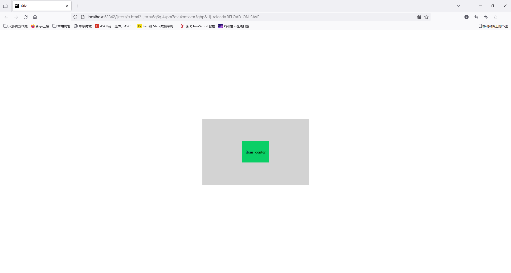

### 盒子居中问题

- 设置位置为absolute（没有父级的时候把整个页面当作父级）并利用transform可以实现盒子的居中

- 利用弹性盒子模型也可以实现盒子的居中

  display为flex设置容器为弹性容器
  justify-content设置沿着主轴的对齐方式
  align-items设置沿着侧轴的对齐方式

- 设置文字行高与盒子相同可以实现盒子中的文字居中

```html
<!DOCTYPE html>
<html lang="en">
<head>
    <meta charset="UTF-8">
    <title>Title</title>
    <style>
        .flex-container{
            position: absolute;
            top: 50%;   <!--相对于父标签的百分之五十-->
            left: 50%;
            transform: translate(-50%, -50%); <!--相对于自身的百分之五十-->
            
            display: flex;
            width: 400px;
            height: 250px;
            justify-content: center;
            align-items: center;
            background-color: lightgrey;
        }
        .flex-item{
            width: 100px;
            height: 80px;
            line-height: 80px;
            text-align: center;
            background-color: #0acf66;
        }
    </style>
</head>

<body>

<div class="flex-container">
    <div class="flex-item">
        item_center
    </div>
</div>

</body>
</html>
```



### 两种盒子模型

- `box-sizing:content-box`为默认值，元素大小只包括区域大小
-  `box-sizing:border-box`表示IE盒子模型，元素的大小包括内容和内边距和边框，不包括外边距
