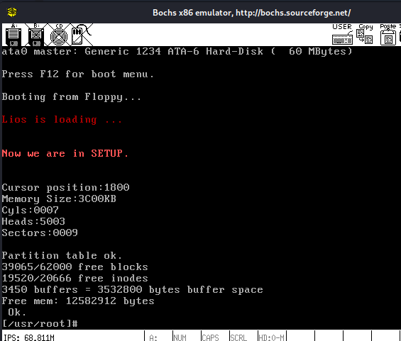
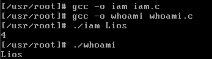

# Lios

## 安装linux-0.11

```shell
git clone https://gitee.com/cn-guoziyang/oslab.git   #获取文件
cd ~/oslab
tar -xvf gcc-3.4-ubuntu.tar.gz  
sudo dpkg -i ./gcc-3.4/gcc-3.4_amd64/*.deb
```

### 报错解决方案

```log
dpkg: error: dpkg frontend lock was locked by another process with pid 2970
Note: removing the lock file is always wrong, can damage the locked area
and the entire system. See <https://wiki.debian.org/Teams/Dpkg/FAQ#db-lock>.
```

```shell
sudo kill 2970  #关闭2970进程后重新执行dpkg指令
sudo dpkg -i ./gcc-3.4/gcc-3.4_amd64/*.deb
```

### 继续安装

```shell
tar -zxvf linux-0.11.tar.gz
sudo apt install bin86 libc6-dev-i386 # 一路Yes
```

## 实验一

### 修改bootsect和setup

```shell
#编译系统
cd linux-0.11
make all 
```

#### 利用vim修改bootsect中和系统启动时显示的字符串相关的代码，然后重新编译系统

```shell
cd ~/oslab/linux-0.11
make all
```

#### 利用vim修改setup中和读取信息相关的代码，然后重新编译系统

```asm
!
!	setup.s		(C) 1991 Linus Torvalds
!
! setup.s is responsible for getting the system data from the BIOS,
! and putting them into the appropriate places in system memory.
! both setup.s and system has been loaded by the bootblock.
!
! This code asks the bios for memory/disk/other parameters, and
! puts them in a "safe" place: 0x90000-0x901FF, ie where the
! boot-block used to be. It is then up to the protected mode
! system to read them from there before the area is overwritten
! for buffer-blocks.
!

! NOTE! These had better be the same as in bootsect.s!

INITSEG  = 0x9000	! we move boot here - out of the way
SYSSEG   = 0x1000	! system loaded at 0x10000 (65536).
SETUPSEG = 0x9020	! this is the current segment

.globl begtext, begdata, begbss, endtext, enddata, endbss
.text
begtext:
.data
begdata:
.bss
begbss:
.text

entry start
start:
!show "Now we are in SETUP."
	mov ah,#0x03
   	xor bh,bh
  	int 0x10
        mov cx,#26
   	mov bx,#0x000C
   	mov bp,#msg2
   	mov ax,cs
   	mov es,ax
   	mov ax,#0x1301
   	int 0x10


! ok, the read went well so we get current cursor position and save it for
! posterity.

	mov	ax,#INITSEG	! this is done in bootsect already, but...
	mov	ds,ax
	mov	ah,#0x03	! read cursor pos
	xor	bh,bh
	int	0x10		! save it in known place, con_init fetches
	mov	[0],dx		! it from 0x90000.
!get prepared for print
	mov ax,cs
        mov es,ax
        mov ax,#INITSEG
        mov ds,ax
	mov ah,#0x03
        xor bh,bh
        int 0x10
! show "cursor position:"
        mov cx,#18
        mov bx,#0x0007
        mov bp,#msg_cursor
        mov ax,#0x1301
        int 0x10
! show the position
	call print_hex

! get memory size
	mov	ah,#0x88
	int	0x15
	mov	[2],ax
! show "memory size"
	mov ah,#0x03
        xor bh,bh
        int 0x10
        mov cx,#14
        mov bp,#msg_memory
        mov ax,#0x1301
        int 0x10
	mov dx,[2]
! show the size
	call print_hex
! add "KB"
	mov ah,#0x03
    	xor bh,bh
    	int 0x10
    	mov cx,#2
       	mov bp,#msg_kb
    	mov ax,#0x1301
    	int 0x10	

! Get video-card data:

	mov	ah,#0x0f
	int	0x10
	mov	[4],bx		! bh = display page
	mov	[6],ax		! al = video mode, ah = window width

! check for EGA/VGA and some config parameters

	mov	ah,#0x12
	mov	bl,#0x10
	int	0x10
	mov	[8],ax
	mov	[10],bx
	mov	[12],cx

! show Cycles
	mov ah,#0x03
    	xor bh,bh
    	int 0x10
    	mov cx,#7
	mov bx,#0x0007  
    	mov bp,#msg_cyles
    	mov ax,#0x1301
    	int 0x10
    	mov dx,[4]
	call	 print_hex
! show heads	 
	mov ah,#0x03
        xor bh,bh
    	int 0x10
    	mov cx,#8
    	mov bx,#0x0007
    	mov bp,#msg_heads
    	mov ax,#0x1301
    	int 0x10
    	mov dx,[6]
    	call    print_hex
! show sectors
	mov ah,#0x03
    	xor bh,bh
    	int 0x10
    	mov cx,#10
    	mov bx,#0x0007
    	mov bp,#msg_sectors
    	mov ax,#0x1301
    	int 0x10
    	mov dx,[12]
    	call    print_hex
	call	print_nl
	call 	print_nl
! Get hd0 data

	mov	ax,#0x0000
	mov	ds,ax
	lds	si,[4*0x41]
	mov	ax,#INITSEG
	mov	es,ax
	mov	di,#0x0080
	mov	cx,#0x10
	rep
	movsb

! Get hd1 data

	mov	ax,#0x0000
	mov	ds,ax
	lds	si,[4*0x46]
	mov	ax,#INITSEG
	mov	es,ax
	mov	di,#0x0090
	mov	cx,#0x10
	rep
	movsb


! Check that there IS a hd1 :-)

	mov	ax,#0x01500
	mov	dl,#0x81
	int	0x13
	jc	no_disk1
	cmp	ah,#3
	je	is_disk1
no_disk1:
	mov	ax,#INITSEG
	mov	es,ax
	mov	di,#0x0090
	mov	cx,#0x10
	mov	ax,#0x00
	rep
	stosb
is_disk1:

! now we want to move to protected mode ...

	cli			! no interrupts allowed !

! first we move the system to it's rightful place

	mov	ax,#0x0000
	cld			! 'direction'=0, movs moves forward
do_move:
	mov	es,ax		! destination segment
	add	ax,#0x1000
	cmp	ax,#0x9000
	jz	end_move
	mov	ds,ax		! source segment
	sub	di,di
	sub	si,si
	mov 	cx,#0x8000
	rep
	movsw
	jmp	do_move

! then we load the segment descriptors

end_move:
	mov	ax,#SETUPSEG	! right, forgot this at first. didn't work :-)
	mov	ds,ax
	lidt	idt_48		! load idt with 0,0
	lgdt	gdt_48		! load gdt with whatever appropriate

! that was painless, now we enable A20

	call	empty_8042
	mov	al,#0xD1		! command write
	out	#0x64,al
	call	empty_8042
	mov	al,#0xDF		! A20 on
	out	#0x60,al
	call	empty_8042

! well, that went ok, I hope. Now we have to reprogram the interrupts :-(
! we put them right after the intel-reserved hardware interrupts, at
! int 0x20-0x2F. There they won't mess up anything. Sadly IBM really
! messed this up with the original PC, and they haven't been able to
! rectify it afterwards. Thus the bios puts interrupts at 0x08-0x0f,
! which is used for the internal hardware interrupts as well. We just
! have to reprogram the 8259's, and it isn't fun.

	mov	al,#0x11		! initialization sequence
	out	#0x20,al		! send it to 8259A-1
	.word	0x00eb,0x00eb		! jmp $+2, jmp $+2
	out	#0xA0,al		! and to 8259A-2
	.word	0x00eb,0x00eb
	mov	al,#0x20		! start of hardware int's (0x20)
	out	#0x21,al
	.word	0x00eb,0x00eb
	mov	al,#0x28		! start of hardware int's 2 (0x28)
	out	#0xA1,al
	.word	0x00eb,0x00eb
	mov	al,#0x04		! 8259-1 is master
	out	#0x21,al
	.word	0x00eb,0x00eb
	mov	al,#0x02		! 8259-2 is slave
	out	#0xA1,al
	.word	0x00eb,0x00eb
	mov	al,#0x01		! 8086 mode for both
	out	#0x21,al
	.word	0x00eb,0x00eb
	out	#0xA1,al
	.word	0x00eb,0x00eb
	mov	al,#0xFF		! mask off all interrupts for now
	out	#0x21,al
	.word	0x00eb,0x00eb
	out	#0xA1,al

! well, that certainly wasn't fun :-(. Hopefully it works, and we don't
! need no steenking BIOS anyway (except for the initial loading :-).
! The BIOS-routine wants lots of unnecessary data, and it's less
! "interesting" anyway. This is how REAL programmers do it.
!
! Well, now's the time to actually move into protected mode. To make
! things as simple as possible, we do no register set-up or anything,
! we let the gnu-compiled 32-bit programs do that. We just jump to
! absolute address 0x00000, in 32-bit protected mode.
	mov	ax,#0x0001	! protected mode (PE) bit
	lmsw	ax		! This is it!
	jmpi	0,8		! jmp offset 0 of segment 8 (cs)

! This routine checks that the keyboard command queue is empty
! No timeout is used - if this hangs there is something wrong with
! the machine, and we probably couldn't proceed anyway.
empty_8042:
	.word	0x00eb,0x00eb
	in	al,#0x64	! 8042 status port
	test	al,#2		! is input buffer full?
	jnz	empty_8042	! yes - loop
	ret

gdt:
	.word	0,0,0,0		! dummy

	.word	0x07FF		! 8Mb - limit=2047 (2048*4096=8Mb)
	.word	0x0000		! base address=0
	.word	0x9A00		! code read/exec
	.word	0x00C0		! granularity=4096, 386

	.word	0x07FF		! 8Mb - limit=2047 (2048*4096=8Mb)
	.word	0x0000		! base address=0
	.word	0x9200		! data read/write
	.word	0x00C0		! granularity=4096, 386

idt_48:
	.word	0			! idt limit=0
	.word	0,0			! idt base=0L

gdt_48:
	.word	0x800		! gdt limit=2048, 256 GDT entries
	.word	512+gdt,0x9	! gdt base = 0X9xxxx

msg2:
	.byte 13,10
	.ascii "Now we are in SETUP."
	.byte 13,10,13,10
msg_cursor:
	.byte 13,10
   	.ascii "Cursor position:"
msg_memory:
   	.byte 13,10
   	.ascii "Memory Size:"
msg_cyles:
   	.byte 13,10
   	.ascii "Cyls:"
msg_heads:
  	.byte 13,10
   	.ascii "Heads:"
msg_sectors:
   	.byte 13,10
   	.ascii "Sectors:"
msg_kb:
    	.ascii "KB"
	
print_hex:
   	 mov    cx,#4
print_digit:
   	 rol    dx,#4
   	 mov    ax,#0xe0f
   	 and    al,dl
   	 add    al,#0x30
   	 cmp    al,#0x3a
   	 jl     outp
  	 add    al,#0x07
outp:
       	 int    0x10
   	 loop   print_digit
  	 ret
print_nl:
	 mov    ax,#0xe0d     ! CR
   	 int    0x10
   	 mov    al,#0xa     ! LF
   	 int    0x10
   	 ret

.text
endtext:
.data
enddata:
.bss
endbss:

```



## 实验二

### 添加系统调用

#### 添加系统调用对应的编号

```asm
#在~/oslab/linux-0.11/include路径下的unistd.h中加入两个系统调用的编号
#define __NR_whoami     72
#define __NR_iam        73                                    
```

#### 修改系统调用总数

```asm
#修改~/oslab/linux-0.11/kernel路径下的system_call.s
nr_system_calls = 72    -->  nr_system_calls = 74
```

#### 新的系统调用设置为外部可见

```asm
#在~/oslab/linux-0.11/include/linux路径下的sys.h中添加
extern int sys_whoami();
extern int sys_iam();
#在fn_ptr sys_call_table[]中加入
system_whoami,system_iam
```

#### 编写.c文件

```c
#在~/oslab/linux-0.11/kernel路径下写who.c文件
#define __LIBRARY__			
#include <unistd.h>		
#include <errno.h>		/* 要求设置错误为EINVAL */
#include <asm/segment.h>	/* 使用put_fs_byte和get_fs_byte */
 
 
char temp[64]={0};		/* 存储sys_iam获取的字符串	*/
 
int sys_iam(const char* name)
{
   int i=0;			/* 用户空间数据name长度	*/
   while(get_fs_byte(name+i)!='\0') i++;	
   if(i>23) return -EINVAL;
   printk("%d\n",i);
   
   i=0;			/* 获取name至temp  */
   while((temp[i]=get_fs_byte(name+i))!='\0'){
	i++;
   }   
    return i;
}
 
int sys_whoami(char* name,unsigned int size)
{
    int i=0;			/* 内核空间数据temp长度 */
    while (temp[i]!='\0') i++;
    if (size<i) return -1;
    
    i=0;			/* 获取temp至name  */
    while(temp[i]!='\0'){	
	put_fs_byte(temp[i],(name+i));
	i++;
    }
    return i;
}
```

#### 修改Makefile文件

```asm
#在~/oslab/linux-0.11/kernel路径下修改Makefile文件
#在OBJS后加入who的信息
who.o
#在  ###Dependencies:  下面加入who的信息
who.s who.o: who.c ../include/linux/kernel.h ../include/unistd.h
```

#### 修改Makefile文件之后重新make

```asm
#在~/oslab/linux-0.11/kernel路径下
make
```

#### 挂载到hdc

```asm
#在~/oslab目录下
sudo ./mount-hdc
cd ~/oslab/hdc/usr/root
sudo gedit ./whoami.c
sudo gedit ./iam.c
```

#### whoami.c

```c
/ / whoami.c
/* whoami.c */
#define __LIBRARY__        
#include "unistd.h" 
_syscall2(int, whoami,char*,name,unsigned int,size);    

int main(int argc, char** argv){
    char buf[30];
    int rlen;
    rlen = whoami(buf, 30);
    printf("%s\n", buf);
    return rlen;
}
```

#### iam.c

```c
/ /  iam.c
/* iam.c  */
#define __LIBRARY__        
#include "unistd.h" 
_syscall1(int, iam, const char*, name); 
int main(int argc, char** argv){
    int wlen = 0;
    if(argc < 1){
        printf("not enougth argument\n");
        return -2;
    }
    wlen = iam(argv[1]);
    return wlen;
}
```

#### 修改头文件

```asm
cp ~/oslab/linux-0.11/include/unistd.h ~/oslab/hdc/usr/include/unistd.h
cp ~/oslab/linux-0.11/include/linux/sys.h ~/oslab/hdc/usr/include/linux/sys.h
```

#### 运行

```shell
cd ~/oslab
sudo umount hdc
cd ~/oslab/linux-0.11
make all
../run
```

#### Bochs编译并执行

```shell
gcc -o iam iam.c
gcc -o whoami whoami.c
./iam Lios
#输出为4代表字符数
./whoami 
#输出为Lios
```



## 实验三

### 进程运行轨迹的跟踪与统计

#### 日志文件说明

##### 进程新建(N)、进入就绪态(J)、进入运行态(R)、进入阻塞态(W) 、退出(E)

#### 提前开启日志统计功能

```c
//在~/oslab/linux-0.11/init目录下修改main.c
//把下面的代码从init函数中在printf("%d buffers = %d bytes buffer space\n\r",NR_BUFFERS,NR_BUFFERS*BLOCK_SIZE);之前加代码
(void)open("/var/process.log",O_CREAT|O_TRUNC|O_WRONLY,0666);
```

#### 添加写log文件的c代码

```c
//在~/oslab/linux-0.11/kernel目录下为printk.c添加代码
#include "linux/sched.h"
#include "sys/stat.h"

static char logbuf[1024];
int fprintk(int fd, const char *fmt, ...)
{
    va_list args;
    int count;
    struct file * file;
    struct m_inode * inode;

    va_start(args, fmt);
    count=vsprintf(logbuf, fmt, args);
    va_end(args);
/* 如果输出到stdout或stderr，直接调用sys_write即可 */
    if (fd < 3)
    {
        __asm__("push %%fs\n\t"
            "push %%ds\n\t"
            "pop %%fs\n\t"
            "pushl %0\n\t"
        /* 注意对于Windows环境来说，是_logbuf,下同 */
            "pushl $logbuf\n\t"
            "pushl %1\n\t"
        /* 注意对于Windows环境来说，是_sys_write,下同 */
            "call sys_write\n\t"
            "addl $8,%%esp\n\t"
            "popl %0\n\t"
            "pop %%fs"
            ::"r" (count),"r" (fd):"ax","cx","dx");
    }
    else
/* 假定>=3的描述符都与文件关联。事实上，还存在很多其它情况，这里并没有考虑。*/
    {
    /* 从进程0的文件描述符表中得到文件句柄 */
        if (!(file=task[0]->filp[fd]))
            return 0;
        inode=file->f_inode;

        __asm__("push %%fs\n\t"
            "push %%ds\n\t"
            "pop %%fs\n\t"
            "pushl %0\n\t"
            "pushl $logbuf\n\t"
            "pushl %1\n\t"
            "pushl %2\n\t"
            "call file_write\n\t"
            "addl $12,%%esp\n\t"
            "popl %0\n\t"
            "pop %%fs"
            ::"r" (count),"r" (file),"r" (inode):"ax","cx","dx");
    }
    return count;
}
```

#### 在新建进程处添加记录的代码

```c
//在~/oslab/linux-0.11/kernel目录下为fork.c增添代码
//在copy_process函数中添加代码
//p->start_time = jiffies;后面添加
fprintk (3, "%ld\tN\t%ld\n", p->pid, jiffies); //记录新建进程的时间
//p->state = TASK_RUNNING;后面添加
fprintk (3, "%ld\tJ\t%ld\n", p->pid,  jiffies);  //记录进程进入就绪态的时间
```

#### 在任务调度处添加记录的代码

```c
//在~/oslab/linux-0.11/kernel目录下为shced.c增添代码
//schedule在(*p)->state=TASK_RUNNING;之后添代码
fprintk(3,"%d\tJ\t%d\n",(*p)->pid,jiffies);
//schedule在switch_to(next);之前添代码
if(current->pid != task[next] ->pid)
{
        /*时间片到时程序 => 就绪*/
        if(current->state == TASK_RUNNING)
            fprintk(3,"%d\tJ\t%d\n",current->pid,jiffies);
        fprintk(3,"%d\tR\t%d\n",task[next]->pid,jiffies);
}
//sys_pause在current->state = TASK_INTERRUPTIBLE;之前添代码
if(current->state != TASK_INTERRUPTIBLE)
    fprintk(3,"%d\tW\t%d\n",current->pid,jiffies);
//sleep_on在current->state = TASK_UNINTERRUPTIBLE;之后添代码
fprintk(3,"%d\tW\t%d\n",current->pid,jiffies);
//sleep_on在tmp->state=0;之后添代码
fprintk(3,"%d\tJ\t%d\n",tmp->pid,jiffies);	
//interruptible_sleep_on在current->state = TASK_INTERRUPTIBLE;之后添代码
fprintk(3,"%d\tW\t%d\n",current->pid,jiffies);
//interruptible_sleep_on在tmp->state=0;之后添代码
fprintk(3,"%d\tJ\t%d\n",tmp->pid,jiffies);
//wake_up在(**p).state=0;之前添代码
if((**p).state != 0)
   fprintk(3,"%d\tJ\t%d\n",(*p)->pid,jiffies);
```

#### 在任务结束处添加记录的代码

```c
//在~/oslab/linux-0.11/kernel目录下为exit.c增添代码
//do_exit在current->state = TASK_ZOMBIE;之后添代码
fprintk(3, "%ld\tE\t%ld\n", current->pid,  jiffies);
//sys_waitpid在current->state=TASK_INTERRUPTIBLE;之后添代码
fprintk(3, "%ld\tW\t%ld\n", current->pid, jiffies);
```

#### 编写样本程序跟踪进程

```c
//挂着hdc之后在~/oslab/hdc/usr/root写process.c
#include <stdio.h>
#include <unistd.h>
#include <time.h>
#include <sys/times.h>
#include <stdlib.h>
#include <sys/wait.h>
#include <sys/types.h>
#include <errno.h>
 
#define HZ    100
 
void cpuio_bound(int last, int cpu_time, int io_time);
 
int main(int argc, char * argv[])
{
       pid_t Pid1;
       pid_t Pid2;
       pid_t Pid3;
 
       Pid1 = fork(); 
       if (Pid1 < 0) printf("error in fork!"); 
       else if (Pid1 == 0) 
            {
                 printf("child process 1:\n");
                 cpuio_bound(10, 1, 0);
            }
 
       Pid2 = fork();
       if (Pid2 < 0) printf("error in fork!"); 
       else if (Pid2 == 0) 
            {
                 printf("child process 2:\n");
                 cpuio_bound(10, 0, 1);
            }
 
       Pid3 = fork();
       if (Pid3 < 0) printf("error in fork!"); 
       else if (Pid3 == 0) 
            {
                 printf("child process 3:\n");
                 cpuio_bound(10, 1, 1);
            }
     
 
       printf("This process's Pid is %d\n", getpid());
       printf("Pid of child process 1 is %d\n", Pid1);
       printf("Pid of child process 2 is %d\n", Pid2);
       printf("Pid of child process 3 is %d\n", Pid3);
       wait(NULL);
       wait(NULL);
       wait(NULL);
       return 0;
}
 
/*
 * 此函数按照参数占用CPU和I/O时间
 * last: 函数实际占用CPU和I/O的总时间，不含在就绪队列中的时间，>=0是必须的
 * cpu_time: 一次连续占用CPU的时间，>=0是必须的
 * io_time: 一次I/O消耗的时间，>=0是必须的
 * 如果last > cpu_time + io_time，则往复多次占用CPU和I/O
 */
void cpuio_bound(int last, int cpu_time, int io_time)
{
    struct tms start_time, current_time;
    clock_t utime, stime;
    int sleep_time;
 
    while (last > 0)
    {
        /* CPU Burst */
        times(&start_time);
        do
        {
            times(&current_time);
            utime = current_time.tms_utime - start_time.tms_utime;
            stime = current_time.tms_stime - start_time.tms_stime;
        } while ( ( (utime + stime) / HZ )  < cpu_time );
        last -= cpu_time;
 
        if (last <= 0 )
            break;
 
        /* IO Burst */
        /* 用sleep(1)模拟1秒钟的I/O操作 */
        sleep_time=0;
        while (sleep_time < io_time)
        {
            sleep(1);
            sleep_time++;
        }
        last -= sleep_time;
    }
}
```


