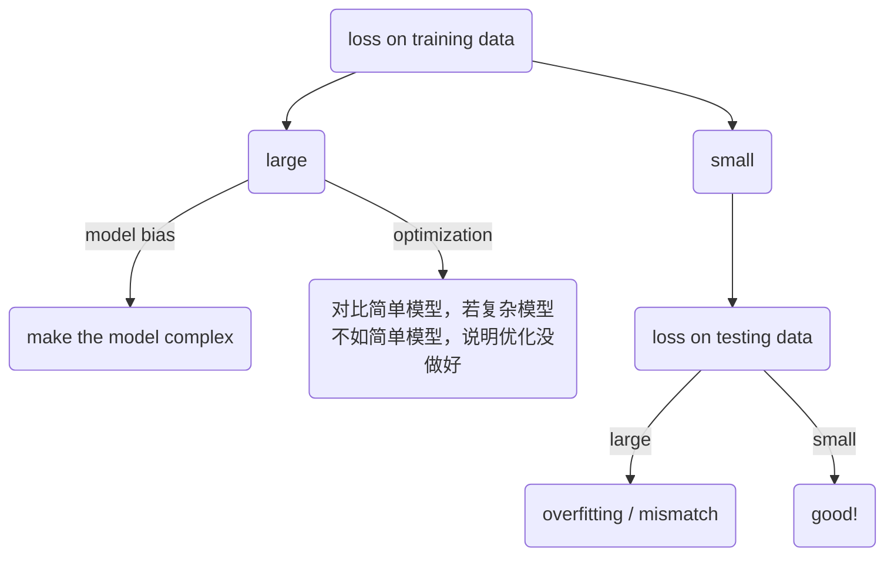

# 模型训练问题与解决方案

## 第一步：判断训练集上的 Loss

模型训练的第一步是观察**训练集上的 loss**。

### 如果训练集 loss 大

说明模型在训练数据上都没有学好，需要进一步判断原因：

- **模型不够大（Model Bias）**：模型的表达能力不足，无法拟合训练数据。
- **优化方法不够好（Optimization Issue）**：模型本身有能力拟合，但优化算法没有找到好的解。

#### 如何区分是模型问题还是优化问题？

**方法：对比简单模型的表现。**

- 拿一些更简单的模型（如浅层网络、线性模型）在同样的数据上训练
- 如果你的深层/复杂模型效果**还不如**这些简单模型，说明问题出在**优化方法**上
  - 因为更复杂的模型理论上表达能力更强，不应该比简单模型差
  - 如果更差，说明优化过程没有让模型发挥出应有的能力
- 如果简单模型效果也差，说明可能确实是**模型不够大**，需要增加模型复杂度

### 如果训练集 loss 小

训练集 loss 小说明模型在训练数据上学得很好，但接下来要看**测试集上的表现**。如果测试集 loss 大，可能是以下两种情况：

- **Overfitting（过拟合）**
- **Mismatch**

#### Overfitting（过拟合）

模型的弹性（flexibility）足够大，使得它预测的曲线能够和已知的训练数据点非常接近，训练集上的 loss 很小。但是在这些已知数据点之外的区域，模型呈现出来的结果非常多样（曲线可能剧烈波动），和真实的曲线并不吻合。

简单来说：模型把训练数据"记住了"，但没有学到真正的规律，导致在未见过的数据上表现很差。

**解决方案：增加训练数据。** 即使模型弹性很大，当样本点足够多时，对模型的限制也就更多了，模型就更容易拟合到真实的那条曲线上，而不是在数据点之间随意波动。

#### Mismatch

（待补充）

---

