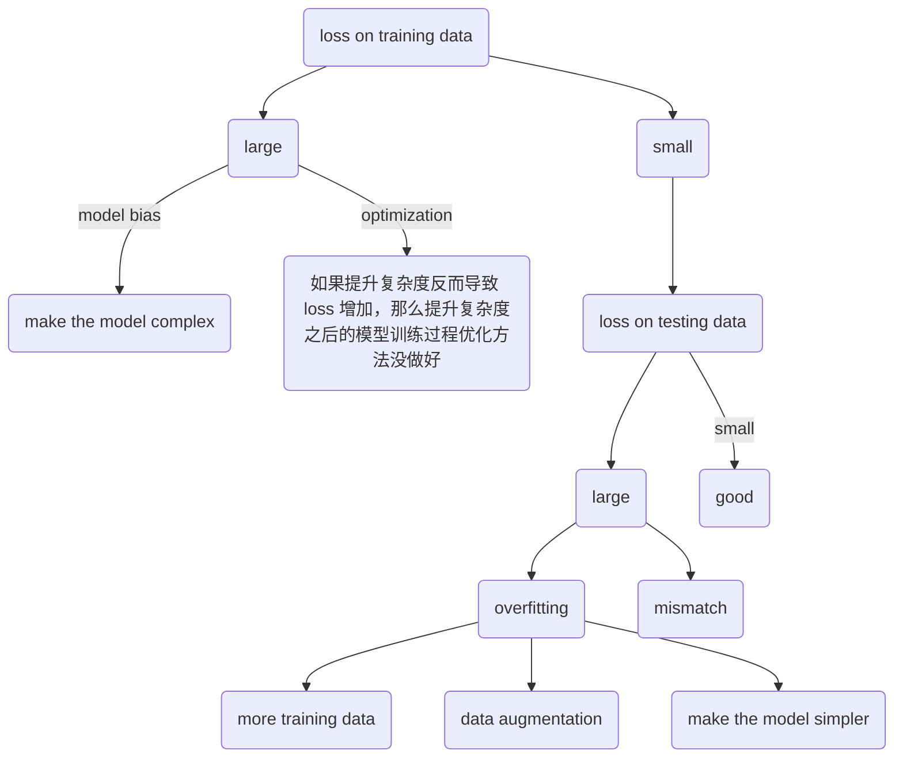

```mermaid
graph TD
A(loss on training data)
A -->B(large)
A -->C(small)
B --> |model bias| D(make the model complex)
B --> |optimization| E(如果提升复杂度反而导致 loss 增加，那么提升复杂度之后的模型训练过程优化方法没做好)
C --> F(loss on testing data)
F --> G(large)
F --> |small| H(good)
G --> I(overfitting)
I --> J(more training data)
I --> K(data augmentation)
I --> M(make the model simpler)
G --> N(mismatch)
```

